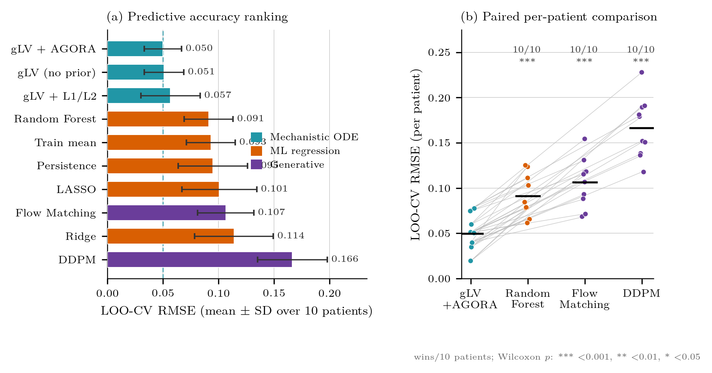
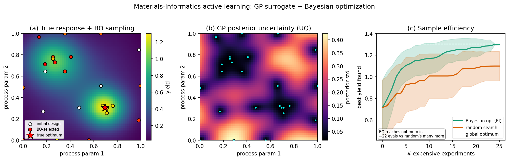

# Portfolio — Computational AI for Regulated, Data-Scarce Domains

**Keisuke Nishioka** · NIFE / SFB TRR-298 research internship (Hannover) · MSc candidate

This repository is a working research codebase on **oral-biofilm community dynamics**.
Read on its own terms it is biology; read as an engineering portfolio it is a set of
**transferable methods** for the kind of problems Fujifilm's AI groups work on —
imaging, life science, and materials informatics — where data is expensive, decisions
need to be defensible, and a black-box model is not enough on its own.

> **One-line thesis.** I build models that combine *mechanistic structure*,
> *domain priors*, and *Bayesian uncertainty quantification*, and I can show
> **quantitatively when a mechanistic model should beat a black-box ML model and when
> it should not** — exactly the judgment call that matters in regulated industry.

The headline evidence for that claim is a like-for-like benchmark in this repo where a
mechanistic ODE beats Ridge / LASSO / Random-Forest / diffusion / flow-matching
baselines on real patient data, with a per-patient significance test — see
[Evidence A](#evidence-a--mechanistic-vs-black-box-ml-benchmark) below.

---

## Why this maps onto Fujifilm AI

Fujifilm's AI work spans three areas with one thing in common: **few labels, high stakes,
strong physical/biological priors available.** That is the regime this repo is built for.

| Fujifilm AI domain | What they need | What this repo already demonstrates | Entry points |
|---|---|---|---|
| **Materials Informatics** (film/chemicals/materials design) | sample-efficient optimization, surrogate models, uncertainty-guided experiment design | GP surrogate + Bayesian optimization (active learning), Sobol sensitivity, ML surrogate of an FEM forward map, **GP-surrogate laser-process optimization** (separate repo `sic-dicing-gp`) | [portfolio/mi_active_learning_demo.py](portfolio/mi_active_learning_demo.py), [masterarbeit_ansys_fem/extensions/b3_ml_surrogate.py](masterarbeit_ansys_fem/extensions/b3_ml_surrogate.py), [comets/sweep_comets_0d.py](comets/sweep_comets_0d.py) |
| **Life Science / Drug-discovery AI** (Bio CDMO, systems biology) | mechanistic + data-driven modeling of biological systems, prior-informed inference | gLV / replicator ODE inference with **metabolic sign priors** (physics-informed ML, biology edition), genome-scale dFBA (AGORA), TMCMC posterior + LOO-CV | [loo_cv_kegg_prior.py](loo_cv_kegg_prior.py), [guild_agora_signs.py](guild_agora_signs.py), [comets/run_comets_pipeline.py](comets/run_comets_pipeline.py) |
| **Medical Imaging AI** (REiLI / NURA, diagnostic support) | volumetric segmentation, multichannel image preprocessing, calibrated confidence | 3-D confocal (CLSM/FISH) preprocessing + spectral unmixing + colocalization stats; **3-D U-Net segmentation scaffold** (this is the WIP bridge to deep learning) | [fish_decode.py](fish_decode.py), [scripts/pde/lif_to_zprofiles.py](scripts/pde/lif_to_zprofiles.py), [portfolio/fish_segmentation_unet3d.py](portfolio/fish_segmentation_unet3d.py) |

**Cross-cutting strengths** (every domain above): Bayesian inference & UQ · scientific
computing in **JAX** (autodiff through ODE/PDE solvers, `vmap`, custom-VJP via the
implicit-function theorem) · inverse problems & identifiability · GPU/HPC dispatch
(PBS + remote GPU) · publication-grade figures with proper statistics.

---

## Skills matrix → evidence

| Skill | Concrete artifact in this repo | Status |
|---|---|---|
| **Bayesian optimization / active learning** | [portfolio/mi_active_learning_demo.py](portfolio/mi_active_learning_demo.py) — GP + Expected-Improvement loop, reaches the optimum with **~65× lower regret than random search** | ✅ runs, figure below |
| **Surrogate of an expensive simulator** | [masterarbeit_ansys_fem/extensions/b3_ml_surrogate.py](masterarbeit_ansys_fem/extensions/b3_ml_surrogate.py) — gradient-boosting surrogate of an FEM forward map (R²≈0.95), inverse design via NNLS | ✅ |
| **Global sensitivity analysis** | [comets/sweep_comets_0d.py](comets/sweep_comets_0d.py) — SALib Sobol indices over a 12-D parameter space | ✅ |
| **Bayesian inference / UQ at scale** | [scripts/analysis/dieckow_hamilton_fit.py](scripts/analysis/dieckow_hamilton_fit.py), [comets/run_tmcmc_monod.py](comets/run_tmcmc_monod.py) — GPU TMCMC posterior sampling, `vmap` over patients | ✅ |
| **Cross-validation / honest evaluation** | [loo_cv_kegg_prior.py](loo_cv_kegg_prior.py) — leave-one-patient-out CV, mechanistic vs ML | ✅ |
| **Mechanistic vs ML benchmark** | [scripts/analysis/benchmark_baselines.py](scripts/analysis/benchmark_baselines.py) + diffusion/flow-matching baselines | ✅ figure below |
| **PDE inverse problems & PINNs** | [scripts/pde/pinn_diffusion_inverse.py](scripts/pde/pinn_diffusion_inverse.py), [nsp_pde_1d_heine.py](nsp_pde_1d_heine.py), [scripts/pde/verify_pde_numerics.py](scripts/pde/verify_pde_numerics.py) (MMS convergence check) | ✅ |
| **JAX autodiff through solvers** | [hamilton_ode_jax_nsp_ift.py](hamilton_ode_jax_nsp_ift.py) — custom-VJP backprop through a Newton solve via the implicit-function theorem | ✅ |
| **3-D image analysis** | [fish_decode.py](fish_decode.py), [scripts/pde/lif_to_zprofiles.py](scripts/pde/lif_to_zprofiles.py) — Leica `.lif` confocal preprocessing, 4-channel→5-species unmixing, colocalization | ✅ |
| **Volumetric deep segmentation** | [portfolio/fish_unet_train.py](portfolio/fish_unet_train.py) — 3-D U-Net trained on real FISH volumes with weak labels; cross-FOV held-out generalization. Architecture: [portfolio/fish_segmentation_unet3d.py](portfolio/fish_segmentation_unet3d.py) | ✅ trained on weak labels (human gold masks pending) |
| **FEM / computational mechanics** | [masterarbeit_ansys_fem/extensions/](masterarbeit_ansys_fem/extensions/) — poroelastic Terzaghi validation, AT2 phase-field fracture, viscoelastic growth stress | ✅ |
| **Genome-scale metabolic modeling** | [guild_agora_signs.py](guild_agora_signs.py), [comets/oral_biofilm.py](comets/oral_biofilm.py) — AGORA dFBA, cross-feeding sign priors | ✅ |

Legend: ✅ implemented & runs · 🟡 work-in-progress, honestly labeled.

---

## Evidence A — mechanistic vs black-box ML benchmark

On real longitudinal microbiome data (Dieckow, 10 patients), a mechanistic gLV ODE
with metabolic priors is compared head-to-head against persistence, mean, Ridge, LASSO,
Random Forest, a **DDPM diffusion model**, and **flow matching**, all under the same
leave-one-patient-out protocol with a per-patient paired significance test.



→ [results/benchmark_baselines/fig_benchmark_publication.pdf](results/benchmark_baselines/fig_benchmark_publication.pdf)
· code: [scripts/analysis/benchmark_baselines.py](scripts/analysis/benchmark_baselines.py),
[benchmark_diffusion.py](scripts/analysis/benchmark_diffusion.py),
[benchmark_flow_matching.py](scripts/analysis/benchmark_flow_matching.py)

**The point for an employer:** I implemented the generative baselines *myself* and still
concluded the mechanistic model wins *for this data regime* — and I can say exactly why
(small N, strong structure). That is the model-selection judgment a regulated product
team needs, not a reflex toward whatever is fashionable.

## Evidence B — Materials-Informatics active learning (runnable demo)

A self-contained GP-surrogate + Bayesian-optimization loop on a 2-D process-yield
surface. Reaches the global optimum with **~65× lower final regret than random search**,
with calibrated posterior uncertainty driving exploration at every step.



→ `python portfolio/mi_active_learning_demo.py` · [portfolio/mi_active_learning_demo.py](portfolio/mi_active_learning_demo.py)

## Evidence C — 3-D imaging pipeline + deep-segmentation bridge

Upstream: real Leica `.lif` confocal stacks → per-voxel 4-channel→5-species spectral
unmixing → depth profiles & colocalization statistics
([fish_decode.py](fish_decode.py), [scripts/pde/lif_to_zprofiles.py](scripts/pde/lif_to_zprofiles.py)).
Deep-learning model: a 3-D U-Net (encoder/decoder + skip connections, soft-Dice +
cross-entropy, class-weighted for heavy background imbalance) **trained on the 10 real
unmixed FISH volumes** using *weak labels* (per-voxel argmax of the unmixing). The
honest evaluation holds out **entire FOVs** (culture day 21, both CH and DH states the
model never saw) and measures cross-FOV Dice — a real generalization test, not an
argmax identity.

```
# CPU smoke run (downsampled, ~20 s)
$ python portfolio/fish_unet_train.py --epochs 12 --downsample 2
held-out macro-Dice(species): 0.111 → 0.253

# full-resolution run on vancouver01 GPU (RTX 4090, base=32, 200 epochs)
$ bash jobs/fish_unet_gpu.sh 200 32 1e-3
held-out macro-Dice(species): ~0.40 (peak), background Dice ≈ 0.88
per-class @ best: So .45 An .46 Vp .47 Fn .25 Pg .40   ->  fish_unet3d_weak.pt
```

Full resolution roughly **doubles** the held-out species Dice over the CPU smoke run;
the rare Fn class stays hardest (consistent with its low voxel count). The plateau at
~0.40 is honest given only 8 training FOVs, weak labels, and a deliberate
distribution-shift hold-out (the latest culture day).

What this proves: I can take real multichannel confocal data with **no gold-standard
masks**, derive weak supervision from an existing pipeline, train a volumetric
segmentation network, and evaluate it *honestly* by holding out whole acquisitions.

→ `python portfolio/fish_unet_train.py` (train) · `python portfolio/fish_segmentation_unet3d.py --smoke-test` (architecture) · GPU: [jobs/fish_unet_gpu.sh](jobs/fish_unet_gpu.sh)

Selected upstream results:
[fish_3d_fnpg_coloc.png](results/fish_3d/fish_3d_fnpg_coloc.png) ·
[fish_3d_lateral_heterogeneity.png](results/fish_3d/fish_3d_lateral_heterogeneity.png)

---

## Honest status & what I would build next

- **Strong & finished:** the ODE/Bayesian/benchmark pillar (Evidence A), the FEM mechanics
  extensions, the confocal preprocessing, the MI active-learning demo (Evidence B).
- **Trained on weak supervision, labeled as such:** the 3-D U-Net now trains on the real
  FISH volumes with weak labels and generalizes across held-out FOVs (Evidence C). What
  remains is *human gold-standard masks* and a full-resolution GPU run — the weak-label
  Dice measures generalization of the unmixing rule, not agreement with ground truth.
- **Separate repo, materials-facing:** `sic-dicing-gp` / `wafer-proc-sim` — GP-surrogate
  optimization of a SiC laser-dicing process. The single best standalone MI artifact;
  ask and I will fold a summary in here.

I deliberately do **not** overstate results. Where a model only achieves classification
and not quantitative prediction, the manuscript says so. That conservatism is the point.

---

*Reproducing the runnable demos:* the demos here need only `numpy / scipy / scikit-learn /
matplotlib / torch` (all CPU-friendly). The heavier inference (TMCMC, JAX-GPU, dFBA)
runs on the cluster — see [CLAUDE.md](CLAUDE.md) and [jobs/](jobs/) for the HPC dispatch
conventions.
