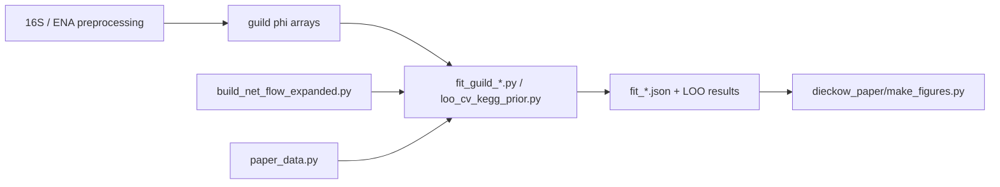

# Architecture — nife

Three modelling pillars sharing the **10-guild taxonomy** (`guild_replicator_dieckow.GUILD_ORDER`).

## Core data flow (paper spine)



## Pillars

| Pillar | Location | Role |
|--------|----------|------|
| **Ecological ODE** (paper) | `scripts/fitting/`, `scripts/loo_cv/`, `loo_cv_kegg_prior.py` | gLV / Hamilton + metabolic sign priors, LOO-CV |
| **COMETS / dFBA** | `comets/` | 5-species mechanistic validation vs AGORA |
| **Metadata ETL** | `export_qiime2.py`, `merge_meta.py`, `tests/` | NGS → QIIME2 / combined metadata |

## Single sources of truth

| File | Purpose |
|------|---------|
| `paper_data.py` | Canonical paths for paper-grade Hamilton 5-species posteriors |
| `guild_replicator_dieckow.py` | 10-guild ordering, colors, ODE RHS |
| `docs/PROVENANCE.md` | Exact commands per figure (LIGHT vs HEAVY) |
| `PAPER_OUTLINE.md` | Manuscript north star |

## Import conventions

- **Scripts** under `scripts/` — bare imports + `# [nife-pathshim]`; run from repo root
- **Package imports** — `from nife.export_qiime2 import ...`; `pip install -e .` or run from parent dir

## Reproduce (local, light)

```bash
./scripts/reproduce_core.sh    # figures + ETL tests
make figures                   # LIGHT matplotlib only
/thesis-sync                   # figures + slide rebuild (see .claude/commands/)
```

Heavy work (LOO GPU, FISH 3D, diffusion HPC) → `jobs/` + `/hpc`, `/gpu`, `/fish3d` slash commands.