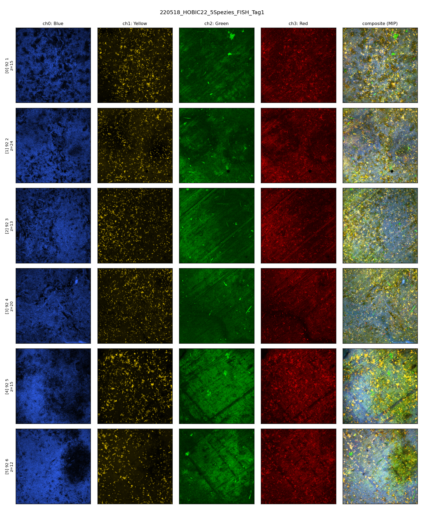
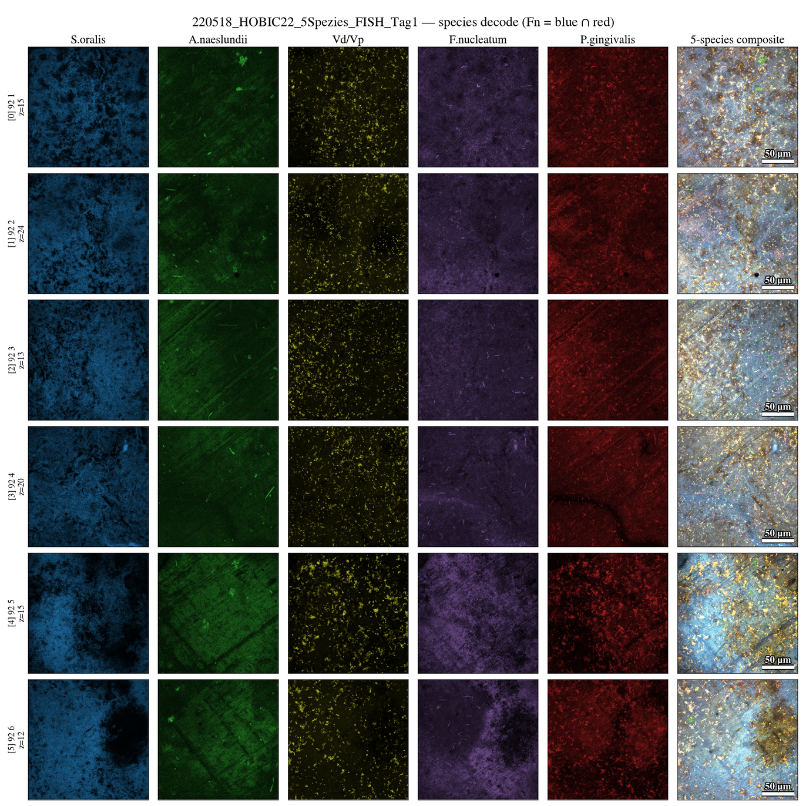
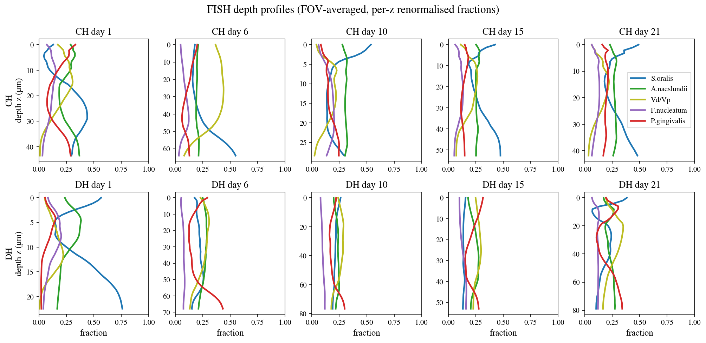
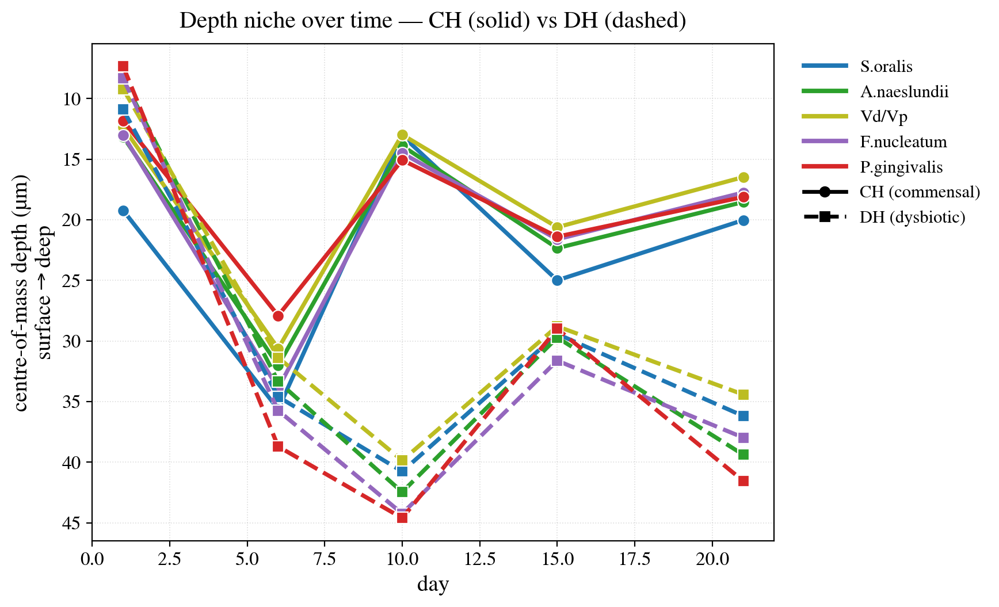
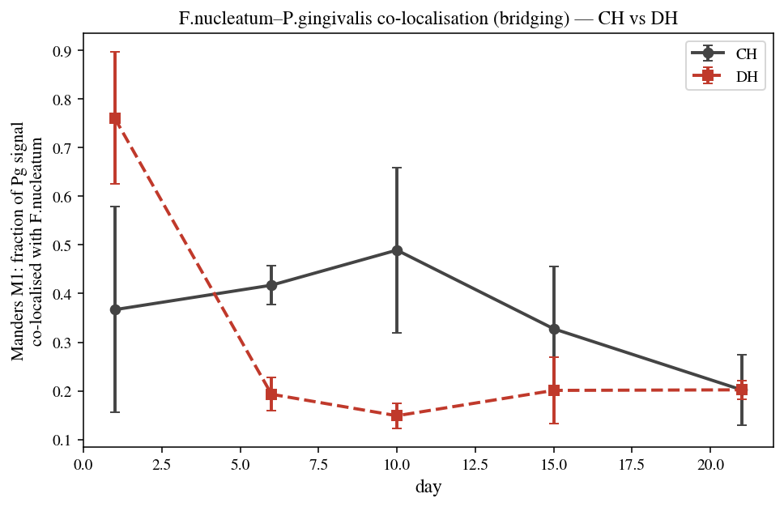

# HOBIC FISH（CLSM）データ処理レポート

**目的**: Heine 2025 のフローチャンバー（HOBIC）FISH 共焦点画像（`.lif`）を、空間 PDE 拡散フィットの入力（深さ方向の5種組成プロファイル）に変換する。

作成: 2026-06-03 / 対象データ: `HOBIC FISH/*.lif`（Szafrański lab → Nils Heine 提供）

---

## 0. 一言でいうと

> 顕微鏡で撮ったバイオフィルムの3D画像を「**深さごとに5菌種がどんな割合でいるか**」の数表に変換した。
> ただし画像は**4色しかないのに菌は5種**なので、論文の標識設計を読み解いて正しく5種に分離するのが肝だった。

---

## 1. どんなデータを処理したのか

Leica 共焦点（CLSM）の `.lif` ファイル全11本（1画素 0.18 µm、z 間隔 2 µm）。1ファイル＝ある実験日のバイオフィルムを複数視野(FOV)で撮った z スタック。**commensal (HOBIC22 → CH) と dysbiotic (HOBIC24 → DH) の2モデル**が揃った。

| 実験ファイル | 条件 | Day | 基質 |
|---|---|---|---|
| 220518 / 220601 / 220720 (Tag1) | CH | 1 | Ti |
| 220817 (Tag15 / Tag21) | CH | 15, 21 | Ti |
| 240416 (Tag6 / Tag10 / Tag15 / Tag21) | CH | 6, 10, 15, 21 | Ti |
| 241203 (Tag1) | DH | 1 | Ti |
| 241018 | DH | 6, 10, 15, 21 | **Ti ＋ Glass 混在** |

- **基質**: HOBIC はチタンインプラントモデル。241018(DH) のみ各日に Ti と Glass の2基質が混在するため、**既定で Ti を採用**（CH も無印＝Ti なので同一基質で比較可能）。Glass 9 FOV は除外し別解析用に温存（`--substrate glass`）。
- **環境はヘッドレス**（`DISPLAY` 無し）→ Fiji / napari の GUI は使えない。`readlif` で読んで **PNG に書き出す自作ツール**で確認・可視化（`lif_quicklook.py`、Times フォント＋µm スケールバー）。

### 生の4チャンネル（撮ったまま）



各行が視野、列が検出チャンネル（Blue / Yellow / Green / Red）＋合成。青が密、黄/緑/赤がスパースな細胞として見える。

---

## 2. 核心：4チャンネル ↔ 5菌種（1対1ではない）

`.lif` の検出器は**4チャンネルしかない**のに、群集は**5菌種**。これは単純な「色＝菌」ではない。

原著 **Heine et al. 2025, *Front. Oral Health* 1649419, Supplementary Table S5 + Methods §2.6** を精読して判明：

> *F. nucleatum was targeted by two probes that shared the same nucleotide sequence, but were labeled with different dyes – resulting in co-localized blue and red fluorescence.*

**F. nucleatum だけ二重標識**（同じ配列のプローブを Alexa 405=青 と Alexa 647=赤 の両方で）。つまり Fn は青と赤の**両方に光る**。

| LUT / レーザ / 検出域 | 寄与する菌種 |
|---|---|
| **Blue** 405 nm / 413–477 nm | S. oralis ＋ **F. nucleatum** |
| **Green** 488 nm / 509–576 nm | A. naeslundii（単独） |
| **Yellow** 552 nm / 576–648 nm | V. dispar/parvula（単独） |
| **Red** 638 nm / 648–777 nm | P. gingivalis ＋ **F. nucleatum** |

この値は `.lif` のメタデータ（レーザ 405/488/552/638、検出窓）と完全一致して裏取り済み。

### 正しい解読（colocalization）

```
F. nucleatum  = Blue ∩ Red          （青と赤の両方に光るボクセル）
S. oralis     = Blue − (Blue ∩ Red)
P. gingivalis = Red  − (Blue ∩ Red)
A. naeslundii = Green
V. dispar/parv= Yellow
```

※ この colocalization は **xy 平均より前に、ボクセル単位**で計算する必要がある（`min` の平均 ≠ 平均の `min`）。

### 解読後の5菌種



F. nucleatum（紫）が S.oralis / P.gingivalis とは別の疎な分布として分離できている。

### 直していなければ起きていたバグ

旧 `lif_to_zprofiles.py` は「青＝S.oralis（純）/ 赤＝P.gingivalis（純）/ 紫＝F.nucleatum」を前提にしていた。実ファイルに紫チャンネルは無いので、そのまま走らせると：

- **F. nucleatum を丸ごと取りこぼす**
- **S.oralis と P.gingivalis を過大計上**（Fn の分が混入）

→ PDE 入力が**3菌種ぶん間違う**ところだった。`fish_decode.py`（両ツール共有の正典デコーダ）で修正済み。

---

## 3. z プロファイル抽出とレプリケート統合

各視野の3Dボクセルを「深さ z ごとの xy 平均強度」に潰し、**5菌種の深さプロファイル**にする。

- **複数 `.lif` を一括入力**し、`(condition, day)` でFOVを**プール（生プロファイルを1回だけ平均）**。
- **Day 1 は別実験日3本（220518/220601/220720）の biological replicate** → 15 視野としてまとめて平均。
- **基質フィルタ** `--substrate ti`：HOBIC24 の Ti/Glass 混在から Ti のみ採用（無印FOVも保持、反対基質だけ除外）。

### Heine のメール規約をツールに実装

Nils Heine からのメール（2026-05-26）の命名規約を自動適用：

- **HOBIC22 = commensal → CH**、**HOBIC24 = dysbiotic → DH**（ファイル名から自動判定）
- 日付は通常ファイル名末尾（`…Tag1`, `…Tag15`）。**HOBIC24 のみ1ファイルに複数日**が混在し、採取日は各 series 名の先頭整数 → 自動でグループ分け。

```bash
# 一発で全部処理（条件・日・レプリケート統合・基質フィルタすべて自動）
python scripts/pde/lif_to_zprofiles.py "HOBIC FISH"/*.lif --substrate ti \
    --out results/diffusion_fit/zprofiles_all_ti.csv
```

### 結果：CH / DH の深さ時系列（Ti）



| 条件 | Day | プールFOV |
|---|---|---|
| CH | 1 / 6 / 10 / 15 / 21 | 15 / 5 / 15 / 16 / 16 |
| DH | 1 / 6 / 10 / 15 / 21 | 7 / 3 / 3 / 2 / 2 |

→ `results/diffusion_fit/zprofiles_all_ti.csv`（400行 = 2条件 × 5日 × 40深さ格子）。
commensal/dysbiotic とも Day1→21 で厚化し、組成が深さ方向にシフト。DH は後期の FOV 数が少ない（Glass 除外のため）。

---

## 4. この後：拡散フィット（`fit_diffusion_clsm.py`）

抽出した深さプロファイルを使って、**菌種ごとの空間的な動きやすさ**を推定する。

**モデル（反応拡散 PDE）** — 組成を決める2つの力：

1. **反応項 (A, b)** = 種間相互作用。**既知**（gLV / TMCMC でバルク時系列から推定済み）。
2. **拡散項 (D_i) ＋ 移流 (u)** = 空間的な動き。**これが未知＝フィット対象**。

```
D_i, u を仮定 → PDEを解いて深さプロファイルを予測 → 実測と比較(MSE)
            ↑______ ズレ最小の D_i, u を探索 (L-BFGS) ______|
```

6パラメータ **D = [D_So, D_An, D_V, D_Fn, D_Pg], u** を、実測の深さプロファイルに合わせて決める。
最適化の1ステップごとに PDE を時間積分するので計算は重い（JAX で高速化）。

```bash
# 本番フィット（条件ごと、Ti統合データ）
python scripts/pde/fit_diffusion_clsm.py --cond CH --data results/diffusion_fit/zprofiles_all_ti.csv
python scripts/pde/fit_diffusion_clsm.py --cond DH --data results/diffusion_fit/zprofiles_all_ti.csv
```

全データ（CH/DH × Day1/6/10/15/21, Ti）が揃ったので **HPC(PBS)で本番フィットを実行**（`fit_diffusion_clsm_job.sh`、frontale01）。

**結果（暫定）** — 拡散係数 D（正規化単位）と移流 u:

| | S.o | A.n | Vd/Vp | F.n | P.g | u | loss |
|---|---|---|---|---|---|---|---|
| **CH** | 0.012 | 0.012 | 0.004 | 0.008 | 0.011 | 0.0038 | 0.128 |
| **DH** | 0.060 | 0.002 | ~2e-5 | 0.002 | 0.008 | 0.0060 | 0.102 |

→ `D_fit_{CH,DH}.json` ＋ `fit_{CH,DH}.png`（予測 vs 実測）。
**注意**: 両条件とも L-BFGS は `success=False`（許容誤差まで未収束）で**暫定値**。DH は後期(Day15/21)が Ti 2 FOV と少なく、Vd/Vp が下限(≈1e-5)に張り付くなど**弱く拘束**。要 restart 増・収束条件見直し。

---

## 5. 空間生態の発見（fit不要・FISH深さ/voxel解析）

フィットを待たずに、深さプロファイルと voxel デコードから論文に効く空間動態が得られた。一貫して **dysbiosis = P.gingivalis の深部・自律コロニー化** を指す。

### P.gingivalis の深部沈降（dysbiosis）



P.gingivalis の重心深さは **DH で Day6 以降 CH より深い（最大 +30 µm）**。嫌気性病原体が dysbiosis で深部の嫌気層にコロニーを作ることと整合（`analyze_depth_niche.py`）。

### F.nucleatum–P.gingivalis 橋渡しは「初期限定」



Fn–Pg 共局在（Manders M1 = Pg信号のうちFnと共在する割合）は **DH 初日に高い（0.76、初期定着の橋渡し）が、Day6以降は CH の方が高く DH では低下（0.15–0.20 vs CH 0.33–0.49）**。→ dysbiosis では Pg が時間とともに Fn から離れ、深部へ**自律化**（`analyze_fish_voxel.py`）。古典的な「Fn橋渡し」は初期定着フェーズの現象。

### その他

- **CH vs DH ダイバージェンス**（Bray-Curtis）は**接種時から ~0.2 で時間的にほぼ一定** — 群集差は初期組成が支配（`ch_dh_divergence.png`）。
- **不確実性**: DH 後期は Ti FOV 2枚で **bootstrap 90% CI が広く**、点推定の弱さを明示（`bootstrap_ci_pg.png`）。
- 総バイオマス(FISH相対)は CH が Day6 ピーク、DH が Day15 まで増加（`biomass_growth.png`）。

### より広い文脈（探索的）

- **拡散 D ↔ 生態的中心性**: 5種の拡散係数 D は gLV の A行列での相互作用強度と**負相関**（CH r=−0.40, DH r=−0.47）→「中心的な種ほど動かない」傾向（5種なので示唆的、`d_vs_centrality.png`）。
- **HOBIC ↔ Dieckow(in-vivo)**: 5種→5ギルドで比較。**ランク一致 ρ=0.70**だが in-vivo は S.oralis 優占(0.63)、HOBIC は等量接種で均等。**CH/DH のバルク存在量はほぼ同一**＝dysbiosis の差は空間/時間（`hobic_vs_dieckow.png`）。

---

## 6. 成果物まとめ

| ファイル | 役割 |
|---|---|
| `fish_decode.py` | **新規**。4ch→5種の正典デコーダ（Fn=blue∩red）。両ツール共有 |
| `scripts/pde/lif_quicklook.py` | **新規**。ヘッドレス可視化（readlif→PNG, Times＋µmバー）。`--mode overview/species/montage` |
| `scripts/pde/lif_to_zprofiles.py` | **修正**。colocalization 解読 ＋ 複数ファイル統合 ＋ メール規約 ＋ 基質フィルタ |
| `figures/lif_quicklook/*.png` | 生4ch・解読5種の確認画像（全11ファイル） |
| `results/diffusion_fit/zprofiles_all_ti.csv` | PDE フィット入力（CH/DH 深さ時系列, Ti） |
| `results/diffusion_fit/D_fit_{CH,DH}.json` | 本番フィット結果（拡散係数 D・移流 u） |

**データの限界（要注意）**: HOBIC（flow chamber）由来なので条件は **CH/DH（HOBIC側）のみ**、static（CS/DS）は本 FISH セットに無い。241018(DH) の **Glass 基質は除外**（別解析用に温存）。DH 後期（Day15/21）は **Ti FOV が2枚**と少なく統計は弱い。
