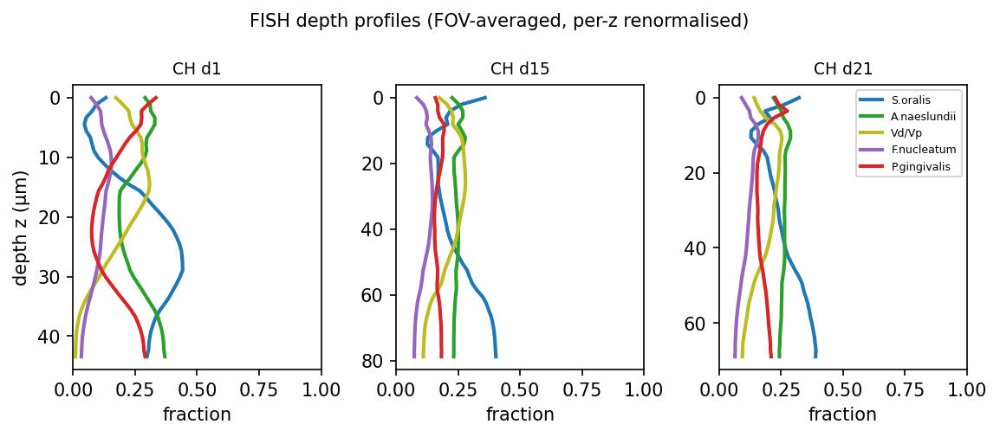

# HOBIC FISH (CLSM) Data-Processing Report

**Goal**: Convert the Heine 2025 flow-chamber (HOBIC) FISH confocal images (`.lif`) into the input for the spatial-PDE diffusion fit — depth-resolved 5-species composition profiles.

Date: 2026-06-03 / Data: `HOBIC FISH/*.lif` (Szafrański lab -> Nils Heine)

---

## 0. In one sentence

> We turned 3-D confocal images of the biofilm into a table of **"which fraction of each of the 5 species is present at each depth."**
> The catch: the images have **only 4 colour channels but the community has 5 species**, so the paper's labelling design had to be decoded to separate them correctly.

---

## 1. What data was processed

Leica confocal (CLSM) `.lif` files. One file = the biofilm on a given experiment day, imaged in several fields of view (FOV) as z-stacks (a stack of optical slices).

| File | Model | Day | FOVs | z-slices | pixel |
|---|---|---|---|---|---|
| 220518_HOBIC22 | commensal | 1 | 6 | 12–24 | 0.18 µm |
| 220601_HOBIC22 | commensal | 1 | 5 | " | " |
| 220720_HOBIC22 | commensal | 1 | 4 | " | " |
| 220817_HOBIC22_Tag15 | commensal | 15 | 7 | " | " |
| 220817_HOBIC22_Tag21 | commensal | 21 | 4 | " | " |

- The environment is **headless** (no `DISPLAY`) -> Fiji / napari GUIs are unavailable.
- So we read the files with `readlif` and wrote **PNG quick-looks** with a small custom tool (`lif_quicklook.py`).

### Raw 4 channels (as acquired)


Each row is a FOV; columns are the detector channels (Blue / Yellow / Green / Red) plus a composite. Blue is dense; yellow/green/red appear as sparser cells.

---

## 2. The core problem: 4 channels <-> 5 species (not one-to-one)

The `.lif` has **only 4 detector channels** but the community has **5 species**. It is not a simple "one colour = one species."

Reading the source — **Heine et al. 2025, *Front. Oral Health* 1649419, Supplementary Table S5 + Methods §2.6** — revealed:

> *F. nucleatum was targeted by two probes that shared the same nucleotide sequence, but were labeled with different dyes – resulting in co-localized blue and red fluorescence.*

**F. nucleatum alone is dual-labelled** (the same probe sequence with both Alexa 405 = blue and Alexa 647 = red), so Fn lights up in **both** the blue and red channels.

| LUT / laser / emission | contributing species |
|---|---|
| **Blue** 405 nm / 413–477 nm | S. oralis + **F. nucleatum** |
| **Green** 488 nm / 509–576 nm | A. naeslundii (clean) |
| **Yellow** 552 nm / 576–648 nm | V. dispar/parvula (clean) |
| **Red** 638 nm / 648–777 nm | P. gingivalis + **F. nucleatum** |

This matches the `.lif` metadata (lasers 405/488/552/638, detection windows) exactly.

### Correct decoding (colocalization)

```
F. nucleatum  = Blue ∩ Red          (voxels positive in both channels)
S. oralis     = Blue − (Blue ∩ Red)
P. gingivalis = Red  − (Blue ∩ Red)
A. naeslundii = Green
V. dispar/parv= Yellow
```

Note: The colocalization must be computed **per voxel, before the xy-average** (mean of `min` ≠ `min` of mean).

### Decoded 5 species


F. nucleatum (purple) is recovered as a sparse distribution distinct from S. oralis / P. gingivalis.

### The bug this avoided

The old `lif_to_zprofiles.py` assumed "blue = pure S.oralis / red = pure P.gingivalis / purple = F.nucleatum." There is no purple channel in the real files, so running it unchanged would have:

- **dropped F. nucleatum entirely**, and
- **over-counted S. oralis and P. gingivalis** (Fn intensity leaking into both).

-> The PDE input would have been **wrong for 3 of the 5 species**. Fixed via `fish_decode.py` (the canonical decoder shared by both tools).

---

## 3. z-profile extraction and replicate merging

Each FOV's 3-D voxel volume is collapsed to "xy-mean intensity per depth z," giving a **5-species depth profile**.

- **Multiple `.lif` files** are taken at once and FOVs are **pooled per `(condition, day)` (raw profiles averaged once)**.
- **Day 1 is a biological replicate of 3 separate experiment dates** (220518/220601/220720) -> averaged together as 15 FOVs.

### Heine's e-mail conventions, implemented in the tool

The file-naming conventions from Nils Heine's e-mail (2026-05-26) are applied automatically:

- **HOBIC22 = commensal -> CH**, **HOBIC24 = dysbiotic -> DH** (auto from filename).
- Day is normally the suffix of the filename (`…Tag1`, `…Tag15`). **Only for HOBIC24 does one file hold several days**, and the sample day is the leading integer of each series name -> grouped automatically.

```bash
# one command does everything (condition, day, replicate merging — all automatic)
python scripts/pde/lif_to_zprofiles.py "HOBIC FISH"/*.lif
```

### Result: commensal HOBIC depth time-series



| condition | day | pooled FOVs | depth |
|---|---|---|---|
| CH | 1 | 15 | 43 µm |
| CH | 15 | 7 | 79 µm |
| CH | 21 | 4 | 69 µm |

-> `results/diffusion_fit/zprofiles_CH_merged.csv` (120 rows = 3 days × 40 depth nodes).
The biofilm thickens over time and the composition shifts with depth.

---

## 4. Next: the diffusion fit (`fit_diffusion_clsm.py`)

Using the extracted depth profiles, we estimate **how mobile each species is in space**.

**Model (reaction–diffusion PDE)** — two forces set the composition:

1. **Reaction term (A, b)** = species interactions. **Known** (estimated from the bulk time-series by gLV / TMCMC).
2. **Diffusion (D_i) + advection (u)** = spatial motion. **Unknown = what we fit**.

```
guess D_i, u -> solve the PDE -> predicted vs observed depth profile (MSE)
            ^___ search D_i, u that minimise the mismatch (L-BFGS) ___|
```

Six parameters **D = [D_So, D_An, D_V, D_Fn, D_Pg], u** are fit to the observed depth profiles. Each optimiser step integrates the PDE in time, so it is compute-heavy (accelerated with JAX).

**This run is a pipeline smoke-test.** The real fit waits for the full dataset (DH = dysbiotic, and the missing Days 3/6/10).

---

## 5. Deliverables

| File | Role |
|---|---|
| `fish_decode.py` | **New**. Canonical 4ch->5sp decoder (Fn = blue∩red). Shared by both tools |
| `scripts/pde/lif_quicklook.py` | **New**. Headless visualiser (readlif->PNG). `--mode overview/species/montage` |
| `scripts/pde/lif_to_zprofiles.py` | **Updated**. Colocalization decode + multi-file merge + e-mail conventions |
| `figures/lif_quicklook/*.png` | Raw-4ch / decoded-5sp check images |
| `results/diffusion_fit/zprofiles_CH_merged.csv` | PDE-fit input (CH depth time-series) |

**Data limitations**: everything in hand is commensal (CH) only. Dysbiotic (DH) not yet received. CH covers only Days 1/15/21 (3/6/10 missing). The static conditions (CS/DS) are not part of this FISH set.
