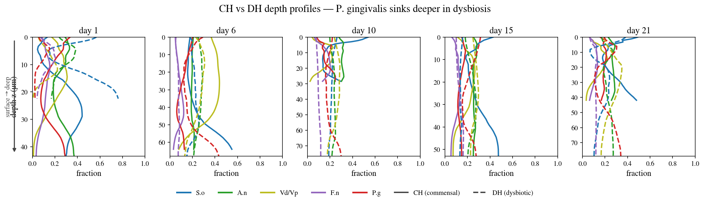
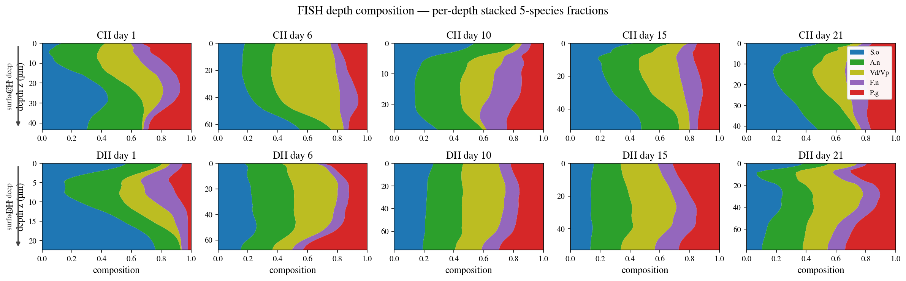

# HOBIC FISH (CLSM) Data-Processing Report

**Goal**: Convert the Heine 2025 flow-chamber (HOBIC) FISH confocal images (`.lif`) into the input for the spatial-PDE diffusion fit — depth-resolved 5-species composition profiles.

Date: 2026-06-03 / Data: `HOBIC FISH/*.lif` (Szafrański lab -> Nils Heine)

---

## 0. In one sentence

> We turned 3-D confocal images of the biofilm into a table of **"which fraction of each of the 5 species is present at each depth."**
> The catch: the images have **only 4 colour channels but the community has 5 species**, so the paper's labelling design had to be decoded to separate them correctly.

---

## 1. What data was processed

All 11 Leica confocal (CLSM) `.lif` files (pixel 0.18 µm, z-step 2 µm). One file = the biofilm on a given experiment day, several FOVs as a z-stack. **Both models are now present: commensal (HOBIC22 -> CH) and dysbiotic (HOBIC24 -> DH).**

| Experiment file(s) | Cond. | Day | Substrate |
|---|---|---|---|
| 220518 / 220601 / 220720 (Tag1) | CH | 1 | Ti |
| 220817 (Tag15 / Tag21) | CH | 15, 21 | Ti |
| 240416 (Tag6 / Tag10 / Tag15 / Tag21) | CH | 6, 10, 15, 21 | Ti |
| 241203 (Tag1) | DH | 1 | Ti |
| 241018 | DH | 6, 10, 15, 21 | **Ti + Glass mixed** |

- **Substrate**: HOBIC is a titanium-implant model. Only 241018 (DH) mixes Ti and Glass FOVs per day, so we **default to Ti** (CH is unlabelled = Ti too, enabling a same-substrate CH vs DH comparison). The 9 Glass FOVs are excluded and kept for a separate analysis (`--substrate glass`).
- The environment is **headless** (no `DISPLAY`) -> Fiji / napari GUIs are unavailable; we read with `readlif` and write **PNG quick-looks** (`lif_quicklook.py`, Times font + µm scale bar).

### Raw 4 channels (as acquired)


Each row is a FOV; columns are the detector channels (Blue / Yellow / Green / Red) plus a composite. Blue is dense; yellow/green/red appear as sparser cells.

---

## 2. The core problem: 4 channels <-> 5 species (not one-to-one)

The `.lif` has **only 4 detector channels** but the community has **5 species**. It is not a simple "one colour = one species."

Reading the source — **Heine et al. 2025, *Front. Oral Health* 1649419, Supplementary Table S5 + Methods §2.6** — revealed:

> *F. nucleatum was targeted by two probes that shared the same nucleotide sequence, but were labeled with different dyes – resulting in co-localized blue and red fluorescence.*

**F. nucleatum alone is dual-labelled** (the same probe sequence with both Alexa 405 = blue and Alexa 647 = red), so Fn lights up in **both** the blue and red channels.

| LUT / laser / emission | contributing species |
|---|---|
| **Blue** 405 nm / 413–477 nm | S. oralis + **F. nucleatum** |
| **Green** 488 nm / 509–576 nm | A. naeslundii (clean) |
| **Yellow** 552 nm / 576–648 nm | V. dispar/parvula (clean) |
| **Red** 638 nm / 648–777 nm | P. gingivalis + **F. nucleatum** |

This matches the `.lif` metadata (lasers 405/488/552/638, detection windows) exactly.

### Correct decoding (colocalization)

```
F. nucleatum  = Blue ∩ Red          (voxels positive in both channels)
S. oralis     = Blue − (Blue ∩ Red)
P. gingivalis = Red  − (Blue ∩ Red)
A. naeslundii = Green
V. dispar/parv= Yellow
```

Note: The colocalization must be computed **per voxel, before the xy-average** (mean of `min` ≠ `min` of mean).

### Decoded 5 species


F. nucleatum (purple) is recovered as a sparse distribution distinct from S. oralis / P. gingivalis.

### The bug this avoided

The old `lif_to_zprofiles.py` assumed "blue = pure S.oralis / red = pure P.gingivalis / purple = F.nucleatum." There is no purple channel in the real files, so running it unchanged would have:

- **dropped F. nucleatum entirely**, and
- **over-counted S. oralis and P. gingivalis** (Fn intensity leaking into both).

-> The PDE input would have been **wrong for 3 of the 5 species**. Fixed via `fish_decode.py` (the canonical decoder shared by both tools).

---

## 3. z-profile extraction and replicate merging

Each FOV's 3-D voxel volume is collapsed to "xy-mean intensity per depth z," giving a **5-species depth profile**.

- **Multiple `.lif` files** are taken at once and FOVs are **pooled per `(condition, day)` (raw profiles averaged once)**.
- **Day 1 is a biological replicate of 3 separate experiment dates** (220518/220601/220720) -> averaged together as 15 FOVs.
- **Substrate filter** `--substrate ti`: keep titanium from the HOBIC24 Ti/Glass mix (unlabelled FOVs kept; only the other substrate dropped).

### Heine's e-mail conventions, implemented in the tool

The file-naming conventions from Nils Heine's e-mail (2026-05-26) are applied automatically:

- **HOBIC22 = commensal -> CH**, **HOBIC24 = dysbiotic -> DH** (auto from filename).
- Day is normally the suffix of the filename (`…Tag1`, `…Tag15`). **Only for HOBIC24 does one file hold several days**, and the sample day is the leading integer of each series name -> grouped automatically.

```bash
# one command does everything (condition, day, merge, substrate filter — all automatic)
python scripts/pde/lif_to_zprofiles.py "HOBIC FISH"/*.lif --substrate ti \
    --out results/diffusion_fit/zprofiles_all_ti.csv
```

### Result: CH / DH depth time-series (Ti)


| Cond. | Day | pooled FOVs |
|---|---|---|
| CH | 1 / 6 / 10 / 15 / 21 | 15 / 5 / 15 / 16 / 16 |
| DH | 1 / 6 / 10 / 15 / 21 | 7 / 3 / 3 / 2 / 2 |

-> `results/diffusion_fit/zprofiles_all_ti.csv` (400 rows = 2 conditions × 5 days × 40 depth nodes).
Both commensal and dysbiotic thicken from Day 1 to 21 with depth-wise composition shifts. DH has few FOVs at late days (Glass excluded).

#### CH vs DH overlaid directly



Each day on one panel (**solid = CH / dashed = DH**, colour = species, y = µm depth, surface -> deep). From day 6 on, the **P. gingivalis (red) dashed line runs deeper than the solid line** — Pg sinking in dysbiosis is read off directly.

```{=latex}
\clearpage
```

#### Per-depth composition (stacked area)



Each depth's 5-species fractions stacked (sum = 1). In the DH bottom row the **red (Pg) band bulges in the deep layers**, the clearest contrast against the CH top row.

(All three regenerate from `zprofiles_all_ti.csv` via `scripts/analysis/plot_depth_profiles.py`.)

---

## 4. Next: the diffusion fit (`fit_diffusion_clsm.py`)

Using the extracted depth profiles, we estimate **how mobile each species is in space**.

**Model (reaction–diffusion PDE)** — two forces set the composition:

1. **Reaction term (A, b)** = species interactions. **Known** (estimated from the bulk time-series by gLV / TMCMC).
2. **Diffusion (D_i) + advection (u)** = spatial motion. **Unknown = what we fit**.

```
guess D_i, u -> solve the PDE -> predicted vs observed depth profile (MSE)
            ^___ search D_i, u that minimise the mismatch (L-BFGS) ___|
```

Six parameters **D = [D_So, D_An, D_V, D_Fn, D_Pg], u** are fit to the observed depth profiles. Each optimiser step integrates the PDE in time, so it is compute-heavy (accelerated with JAX).

```bash
# production fit, per condition, on the Ti-merged data
python scripts/pde/fit_diffusion_clsm.py --cond CH --data results/diffusion_fit/zprofiles_all_ti.csv
python scripts/pde/fit_diffusion_clsm.py --cond DH --data results/diffusion_fit/zprofiles_all_ti.csv
```

With the full dataset in hand (CH/DH × Days 1/6/10/15/21, Ti), the **production fit is run on the HPC** (`fit_diffusion_clsm_job.sh`, frontale01).

**Results (preliminary)** — diffusivities D (normalised units) and advection u:

| | S.o | A.n | Vd/Vp | F.n | P.g | u | loss |
|---|---|---|---|---|---|---|---|
| **CH** | 0.012 | 0.012 | 0.004 | 0.008 | 0.011 | 0.0038 | 0.128 |
| **DH** | 0.060 | 0.002 | ~2e-5 | 0.002 | 0.008 | 0.0060 | 0.102 |

-> `D_fit_{CH,DH}.json` + `fit_{CH,DH}.png` (predicted vs observed).
**Caveat**: both fits report `success=False` (L-BFGS did not reach tolerance), so these are **preliminary**. DH is weakly constrained at late days (2 Ti FOVs), with Vd/Vp pinned at the lower bound (~1e-5). Needs more restarts / revised convergence settings.

---

## 5. Spatial-ecology findings (fit-free, from the FISH depth / voxels)

Without waiting for the fit, the depth profiles and voxel decode already give
paper-relevant spatial dynamics — all pointing to **dysbiosis = a deep, autonomous
P. gingivalis colony**.

### P. gingivalis sinks deep in dysbiosis


P. gingivalis' centre-of-mass depth is **deeper in DH than CH from day 6 on (up to
+30 µm)** — the anaerobic pathogen colonises the deep anaerobic layers as dysbiosis
develops (`analyze_depth_niche.py`).

### F. nucleatum–P. gingivalis bridging is an early-only effect


Fn–Pg co-localisation (Manders M1 = fraction of Pg signal sitting with Fn) is **high
in DH at day 1 (0.76, early co-colonisation) but LOWER than CH from day 6 on
(0.15–0.20 vs CH 0.33–0.49)**. In dysbiosis P. gingivalis **decouples** from
F. nucleatum over time and goes deep (`analyze_fish_voxel.py`). The classic
"Fn bridge" is an early-colonisation phenomenon.

### Also

- **CH-vs-DH divergence** (Bray-Curtis) is **~0.2 from day 1 and roughly flat** — the
  difference is set by the inoculum (`ch_dh_divergence.png`).
- **Uncertainty**: DH late days (2 Ti FOVs) give **wide bootstrap 90% CIs**, making the
  weak point-estimate explicit (`bootstrap_ci_pg.png`).
- Relative FISH biomass peaks at day 6 (CH) vs day 15 (DH) (`biomass_growth.png`).

### Broader context (exploratory)

- **Diffusivity D ↔ ecological centrality**: the 5 species' fitted D correlate
  **negatively** with their gLV interaction strength (CH r=−0.40, DH r=−0.47) —
  "central species move less" (5 species → illustrative, `d_vs_centrality.png`).
- **HOBIC ↔ Dieckow (in-vivo)**: mapping the 5 species to 5 guilds, the rank order
  agrees (**Spearman ρ=0.70**) but in-vivo is S.oralis-dominated (0.63) whereas the
  defined in-vitro inoculum is even. CH and DH bulk abundances are nearly identical
  — so the dysbiosis signal is spatial/temporal, not bulk composition
  (`hobic_vs_dieckow.png`).

---

## 6. Deliverables

| File | Role |
|---|---|
| `fish_decode.py` | **New**. Canonical 4ch->5sp decoder (Fn = blue∩red). Shared by both tools |
| `scripts/pde/lif_quicklook.py` | **New**. Headless visualiser (readlif->PNG). `--mode overview/species/montage` |
| `scripts/pde/lif_to_zprofiles.py` | **Updated**. Colocalization decode + multi-file merge + e-mail conventions + substrate filter |
| `figures/lif_quicklook/*.png` | Raw-4ch / decoded-5sp check images (all 11 files) |
| `results/diffusion_fit/zprofiles_all_ti.csv` | PDE-fit input (CH/DH depth time-series, Ti) |
| `results/diffusion_fit/D_fit_{CH,DH}.json` | Production-fit results (diffusivities D, advection u) |

**Data limitations**: being flow-chamber (HOBIC) data, only **CH/DH (the HOBIC conditions)** are present — the static CS/DS are not in this FISH set. The **Glass substrate of 241018 (DH) is excluded** (kept for a separate analysis). DH late days (15/21) have only **2 Ti FOVs**, so their statistics are weak.
