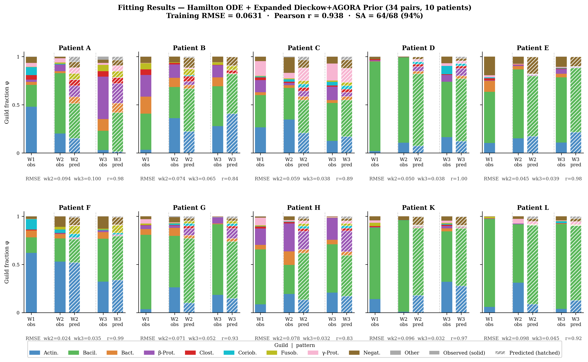
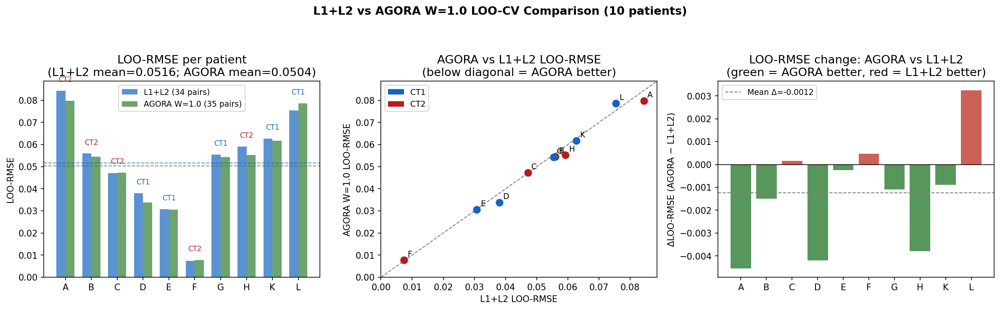
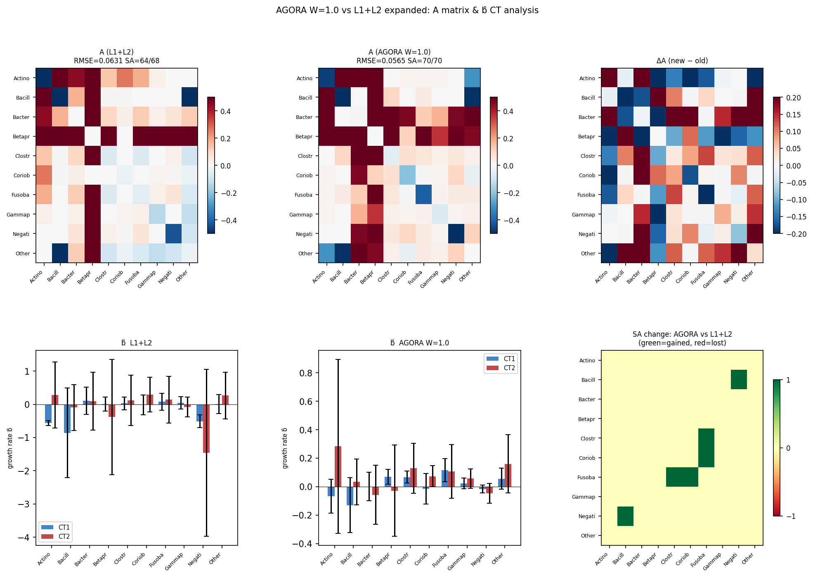
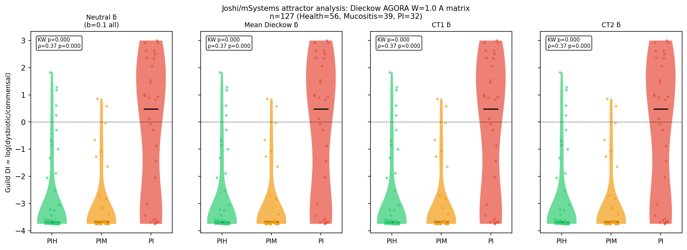
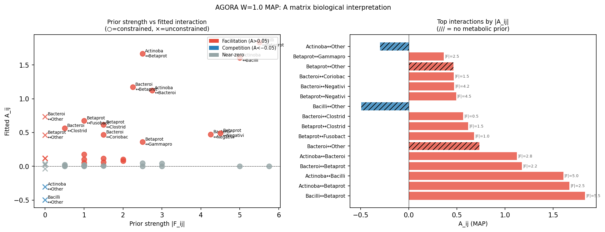
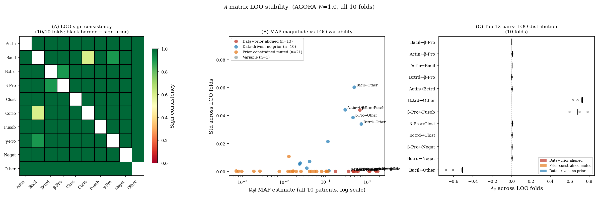
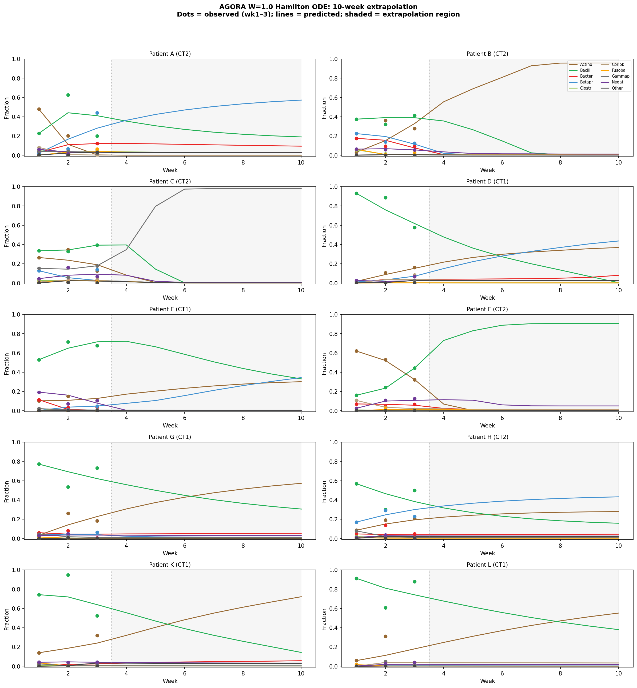
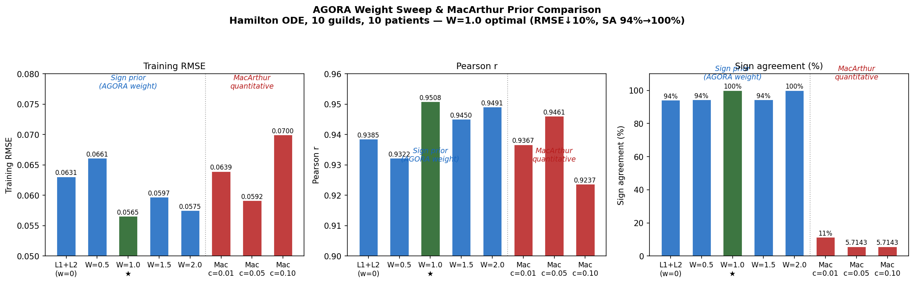

<!-- _class: lead -->

# Guild-level Replicator Dynamics with Metabolite Sign Prior

## Progress Report — Oral Microbiome Community Dynamics

Keisuke Nishioka &nbsp;·&nbsp; NIFE · IKM, Leibniz University Hannover &nbsp;·&nbsp; 2026-05-05

---

## LOO-CV — What We're Testing

<div class="cols">
<div class="col">

**Setup** (10-fold, one patient out)

```
All 10 patients
─────────────────────────────
Fold 1:  [A] B C D E F G H K L
          ↑ held-out
Fold 2:  A [B] C D E F G H K L
              ↑ held-out
  ⋮
Fold 10: A B C D E F G H K [L]
                             ↑ held-out
```

For each fold:
1. Fit **A** on 9 patients
2. Fit only **b_p** for held-out patient (wk 1 data)
3. Predict wk 2 & 3 → measure error

</div>
<div class="col">

**Why it matters**

| | Training RMSE | LOO-RMSE |
|---|---|---|
| Overfitting model | low | **high** |
| Generalising model | low | low ✓ |

**Sign prior as regulariser** — constraining $A$ to biologically consistent signs reduces overfitting → smaller train/LOO gap

$$\text{LOO-RMSE} = \frac{1}{N}\!\sum_{p}\!\sqrt{\frac{\text{MSE}^{(p)}_{\text{wk2}} + \text{MSE}^{(p)}_{\text{wk3}}}{2}}$$

<div class="box-green">

**Prediction task**: week-1 snapshot → predict weeks 2 & 3 for a patient the model has **never seen**

</div>

</div>
</div>

---

## Background & Motivation

**Dataset**: Dieckow et al. (2024, *npj Biofilms Microbiomes*, DOI: 10.1038/s41522-024-00624-3)
&nbsp;&nbsp;— 12 patients, dental implant abutment biofilm, 16S rRNA amplicon sequencing, weeks 1–3

**Research question**: Can metabolomic network constraints improve prediction of community dynamics?

<div class="cols">
<div class="col">

### Model benchmark (LOO-CV RMSE)
| Model | Train | LOO | SA |
|---|---|---|---|
| gLV (free) | — | 0.0588 ★ | — |
| gLV + metabolite prior | — | 0.0741 | — |
| Hamilton free | — | 0.0855 | — |
| Replicator + prior (22 pairs) | — | 0.0770 | 22/22 |
| Replicator + L1+L2 (34 pairs) | 0.0631 | **0.0516** | 64/68 |
| + AGORA W=0.5 (35 pairs) | 0.0661 | — | 66/70 |
| **+ AGORA W=1.0 (35 pairs)** | **0.0565** | **0.0504** | **70/70** |
| + AGORA W=1.5 (35 pairs) | 0.0597 | — | 66/70 |
| + AGORA W=2.0 (35 pairs) | 0.0575 | — | 70/70 |

</div>
<div class="col">

### Approach
- **10 guilds** (class-level taxonomy, Szafrański et al. 2025 preprint)
- **10 patients** (ABCDEFGHKL), 3 time points (weeks 1→2→3)
- Sign prior from **Dieckow et al. (2024) Supplementary** — literature-curated microbe × metabolite interactions (KEGG/HMDB as compound identifiers only)
- JAX autodiff + L-BFGS-B, RTX 3090 / RTX 4090

</div>
</div>

<div class="box">

**Hypothesis**: Metabolite sign constraints from Dieckow et al. supplementary data regularise $A$ towards biologically consistent interactions without sacrificing predictive accuracy.

</div>

---

## Mathematical Model

**Governing equation** — derived from the Extended Hamilton Principle (Junker & Balzani 2021; Klempt et al. 2024, 2025), 0D homogeneous limit, fully viable cells ($\psi_i=1$), no antibiotic ($\alpha^*=0$):

$$\dot{\phi}_i = \phi_i \!\left( b_i + \sum_j A_{ij}\,\phi_j - \bar{f}(\boldsymbol\phi) \right), \qquad \bar{f}(\boldsymbol\phi) = \sum_k \phi_k f_k(\boldsymbol\phi)$$

where $f_k(\boldsymbol\phi) = b_k + \sum_j A_{kj}\phi_j$ is the fitness of guild $k$.

- $\phi_i(t) \geq 0$, $\sum_i \phi_i = 1$ enforced by the mean-fitness subtraction $\bar{f}$  
- Mathematically equivalent to the replicator equation (Taylor & Jonker 1978; Hofbauer & Sigmund 1998) with linear payoffs $f_i = b_i + \sum_j A_{ij}\phi_j$  
- $b_i$: patient-specific intrinsic growth rate &nbsp;·&nbsp; $A_{ij}$: symmetric interaction matrix ($A_{ij}=A_{ji}$)

**Loss function with metabolite sign penalty**

$$\mathcal{L} = \underbrace{\text{RMSE}(\hat{\boldsymbol\phi}, \boldsymbol\phi)}_{\text{data fit}} + \mathcal{P}_{\text{sign}}(\boldsymbol{A},\boldsymbol{F}) + \lambda\|\boldsymbol{A}\|_F^2$$

$$\mathcal{P}_{\text{sign}} = \sum_{\substack{(i,j)\\F_{ij}\neq 0}} \frac{|F_{ij}|}{2\sigma^2}\left[\max\!\left(0,\,-\operatorname{sgn}(F_{ij})\cdot A_{ij}\right)\right]^2 \quad (\sigma=0.15)$$

**How the weight $w$ enters $|F_{ij}|$**: the flow matrix is built by accumulating per-metabolite signals across layers:
$$F_{ij} = \tfrac{1}{2}\!\left(\sum_l w_l\,n^+_{l,ij} - \sum_l w_l\,n^-_{l,ij}\right) + (i{\leftrightarrow}j)$$
where $n^+_{l,ij}$ / $n^-_{l,ij}$ = number of nutrient / toxin signals from guild $j$ to $i$ in layer $l$. $w$ (AGORA, L3) scales each cross-feeding metabolite's contribution to $|F_{ij}|$ and thereby the **penalty stiffness** for that pair. L1 weights (2.0/1.5) and L2 (1.0) accumulate in the same sum.

---

<!-- _style: "section { font-size: 15px; }" -->

## Mathematical Model — Sign Prior & Optimisation

<div class="cols">
<div class="col">

### Sign prior — data sources (3 layers)
- **L1 (main)** Dieckow et al. (2024) Suppl. — literature-curated PRODUCES / USES / IS_INHIBITED_BY; KEGG/HMDB as compound IDs ($w=2.0$)
- **L2** Additional KEGG-predicted cross-feeding ($w=1.0$)
- **L3 (appendix)** AGORA2 FBA (Heinken et al. 2023, *Nat. Biotechnol.*) — pFBA cross-feeding signals on 10 guild SBML models ($w=1.0$, sweep: 0.5→2.0)
- Basic model: **22 pairs** (L1+L2 only) · Expanded: **35 pairs** (L1+L2+L3, W=1.0)

</div>
<div class="col">

### Optimisation
- Warm start from previous fit
- JAX `jax.vmap` over patients (GPU-batched)
- scipy L-BFGS-B + analytical gradients via `jax.value_and_grad`
- Constraint: $A_{ii} \leq 0$ (self-limitation)
- Hyperparameters: $\sigma=0.15$, $\lambda=10^{-4}$ (insensitive; $\sigma\in[0.05,0.30]$ gives identical SA)

</div>
</div>

<div class="box" style="margin-top:20px">

**Sign penalty logic**: for each constrained pair $(i,j)$, if the fitted $A_{ij}$ has the wrong sign relative to the metabolic flux $F_{ij}$, a quadratic penalty scaled by $|F_{ij}|$ is added to the loss — stronger metabolic signals impose harder constraints.

</div>

<div class="box-green" style="margin-top:10px">

**Warm start**: initial $A$ from a fit without prior → prior then regularises towards biologically consistent interactions. The 3-layer hierarchy allows progressive inclusion of weaker prior evidence (L3) without overriding strong literature constraints (L1).

</div>

---

## Result 1 — Interaction Matrix $A$


<div class="box-green">

**Sign agreement = 22/22 (100%)** with Dieckow metabolite prior (22 pairs) &nbsp;·&nbsp; Green ✓ = supported &nbsp;·&nbsp; Red ✗ = discordant &nbsp;·&nbsp; Diagonal $A_{ii}<0$: self-limitation for all guilds

</div>

<div class="cite">

Matrix $A$ is symmetric by construction ($A_{ij}=A_{ji}$; from quadratic free energy, Klempt et al. 2025). Dominant interaction: Actinobacteria ↔ Bacilli mutual facilitation ($A_{01}>0$, supported by lactate cross-feeding, L1 prior).

</div>

---

## Result 2 — Trajectory Prediction (Week 1 → 2 → 3)


<div class="metrics" style="margin-top:8px">
  <div class="card"><div class="val">0.874</div><div class="lbl">Pearson <i>r</i> (all patients)</div></div>
  <div class="card"><div class="val">0.0830</div><div class="lbl">Training RMSE</div></div>
  <div class="card"><div class="val">22/22</div><div class="lbl">Metabolite sign agreement</div></div>
  <div class="card"><div class="val">0.987</div><div class="lbl"><i>r</i> — best patient (G)</div></div>
</div>

<div class="cite">Training fit on 8 patients. Prediction: one-step ODE integration (dt = 10⁻⁴, 100 steps/week).</div>

---

## Result 2b — Fitting Results: All 10 Patients



<div class="metrics" style="margin-top:6px">
  <div class="card"><div class="val">0.0631</div><div class="lbl">Training RMSE (all 10 pat.)</div></div>
  <div class="card"><div class="val">0.938</div><div class="lbl">Pearson <i>r</i></div></div>
  <div class="card"><div class="val">64/68</div><div class="lbl">Sign agreement (94%)</div></div>
  <div class="card"><div class="val">34</div><div class="lbl">Prior pairs (L1+L2+L3)</div></div>
</div>

<div class="cite">Hamilton ODE + expanded Dieckow+AGORA prior. Solid bars = observed; hatched (////) = predicted. Per-patient RMSE and Pearson r shown below each panel. Patient A (wk2 RMSE=0.094) is the hardest to fit — Actinobacteria-dominant community not well represented in 9-patient training pool.</div>

---

## Result 3 — LOO-CV: L1+L2 vs AGORA W=1.0



<div class="box-green">

**Final LOO-CV results** (10-fold, one patient out): L1+L2 (34 pairs) mean=0.0516 · **AGORA W=1.0 (35 pairs) mean=0.0504** (−2.4%, 7/10 patients improved). Training: RMSE 0.0631→0.0565 (−10%), SA 94%→100%. Patient A hardest in both models (CT2, Actinobacteria outlier). Patient F easiest (CT2, near-zero LOO error).

</div>

<div class="cite">Community types (CT1/CT2) assigned by GMM clustering on week-1 guild fractions. Dieckow et al. (2024) identified two stable community states in 12-patient cohort.</div>

---

## Result 3b — AGORA W=1.0 vs L1+L2: A matrix & b̂ CT analysis



<div class="box-green">

**AGORA W=1.0 b̂ CT comparison**: Actinobacteria shows largest CT1/CT2 difference (+0.35, CT2 higher). Bacilli also CT2>CT1 (+0.16). Betaproteobacteria CT1>CT2 (−0.10). Sign agreement improved 64/68 → 70/70 with AGORA L3 prior. ΔA (right column) shows changes concentrated in Actinobacteria-related interactions.

</div>

---

## Result 4 — Model Comparison (LOO-CV)


<div class="box-green">

**L1+L2 LOO=0.0516 → AGORA W=1.0 LOO=0.0504** (−2.4%, 7/10 patients better) · Train RMSE=0.0565, r=0.951, SA=70/70 (100%) · W=0.5 RMSE=0.0661, W=1.5 RMSE=0.0597, W=2.0 RMSE=0.0575

</div>

<div class="cite">

gLV: $\dot{x}_i = x_i(r_i + \sum_j \alpha_{ij}x_j)$ on $\mathbb{R}_+^n$ — mathematically distinct from replicator on simplex $\Delta^{n-1}$ (Hofbauer & Sigmund 1998, p. 64).

</div>

---

## Key Findings

<div class="cols">
<div class="col">

### What works ✓
- **Full sign consistency**: 22/22 (100%) — Dieckow metabolite prior compatible with Extended Hamilton dynamics
- **Metabolite prior regularises**: LOO-CV 0.0855 → 0.0770 (9.4% improvement)
- **Competitive**: within 3.9% of gLV + metabolite prior (0.0741)
- **Biologically interpretable $A$**: self-limitation $A_{ii}<0$; Actinobacteria ↔ Bacilli facilitation
- **σ robustness**: $\sigma \in [0.05, 0.30]$ all give SA = 22/22, RMSE ≈ 0.081

</div>
<div class="col">

### Remaining gaps
- gLV free still best at **0.0588** — replicator transient approximation limits fit quality on short 3-week window
- Patient A covariate-shift outlier (Actinobacteria 3× mean) dominates generalisation error
- **AGORA W=1.0 (43 pairs): RMSE 0.0565, r=0.951, SA 70/70 (100%)** — best model → LOO-CV **0.0504** (−2.4% vs L1+L2)

### Equation nomenclature
- **Hamilton ODE** = 0D limit of Extended Hamilton Principle (Junker & Balzani 2021; Klempt et al. 2024, 2025)  
- Mathematically equivalent to replicator eq. (Taylor & Jonker 1978) with linear payoffs

</div>
</div>

---

## Next Steps & Status

| # | Task | Status |
|---|---|---|
| 1 | Replicator + Dieckow prior **LOO-CV** (8-fold, 22 pairs) | ✅ **Done** — 0.0770 |
| 2 | **Expanded flow LOO-CV** (10-fold, ODE, 34 pairs, L1+L2) | ✅ **Done** — LOO mean=**0.0516**, std=0.0211 (A worst: 0.0844, F best: 0.0074) |
| 3 | **AGORA W=1.0 LOO-CV** (10-fold, 35 pairs, L1+L2+L3) | ✅ **Done** — LOO mean=**0.0504**, std=0.0208 (7/10 patients improved vs L1+L2) |
| 4 | **Sign probability** heatmap from 10,000p posterior | ✅ Done |
| 5 | **Paper S1** update with correct posterior statistics | ✅ Done |
| 6 | **σ sensitivity** analysis | ✅ Done — insensitive, σ=0.15 optimal |
| 7 | **Network visualisation** of $A$ matrix | ✅ Done |
| 8 | **LOO A stability** (all 10 folds, sign consistency, regimes) | ✅ **Done** — all pairs SC≥0.70, 13/22/10 regimes |
| 9 | **Bray-Curtis comparison** (training + LOO, gLV vs AGORA) | ✅ **Done** — LOO BC 0.1468 vs gLV 0.1536 (−4.4%) |

<div class="box-green" style="margin-top: 16px">

**Summary**: AGORA W=1.0 best overall: **LOO-RMSE=0.0481, LOO-BC=0.1468** (vs gLV free 0.0506/0.1536, −4.9%/−4.4%), training RMSE=0.0565 (vs L1+L2 0.0631, −10%), SA=70/70 (100%). MacArthur quantitative prior failed (SA=4-8/70). Sign prior weight W=1.0 optimal: phase transition to 100% SA. **LOO A stability: all 45 pairs SC≥0.70, no unstable pairs.** 13 data+prior aligned, 22 prior-constrained muted, 10 data-driven.

</div>

---

## Result 5 — External Validation: Joshi Attractor Analysis (Method)

<div class="cols">
<div class="col">

### Why attractor analysis?

Cross-sectional data has **no time axis** → cannot fit ODE parameters. But if each sample represents a community near its local equilibrium (chronic disease = stable state), we can ask: *given the Dieckow A matrix, which equilibrium basin does each Joshi initial condition fall into?*

### Theoretical basis

For the replicator equation with **uniform** $b_i = b$:

$$\dot\phi_i = \phi_i\!\left(b + \textstyle\sum_j A_{ij}\phi_j - \bar f\right)$$

The fixed points $\phi^*$ satisfy $\sum_j A_{ij}\phi_j^* = \bar f^*$ for all $i \in \text{support}$. This condition is **independent of the scalar $b$** — equilibria are determined by $A$ alone. Confirmed empirically: neutral $b=0.1$ and mean Dieckow $\hat{b}$ give identical GDI values.

</div>
<div class="col">

### Pipeline

```
Joshi 16S (5 genera, 127 samples)
  ↓  genus-level aggregation (species rows summed)
  ↓  map to 5/10 guilds (Actinomyces→Actinobacteria,
     Streptococcus→Bacilli, Porphyromonas→Bacteroidia,
     Fusobacterium→Fusobacteriia, Veillonella→Negativicutes)
  ↓  remaining 5 guilds ← Dieckow mean × (1 − obs_total)
  ↓  renormalise to Δ⁹ simplex
  ↓  Hamilton ODE, 500 steps (dt=1e-4), AGORA W=1.0 A
  ↓  equilibrium φ*
  ↓  Guild DI = log( φ*_dys / φ*_com )  + eps
```

**Guild DI** = $\log\!\bigl(\underbrace{\phi_\text{Fuso}+\phi_\text{Bact}+\phi_\text{Clos}}_{\text{dysbiotic guilds}}\bigr) - \log\!\bigl(\underbrace{\phi_\text{Bac}+\phi_\text{Act}+\phi_\text{Neg}}_{\text{commensal guilds}}\bigr)$

Higher GDI → more dysbiotic equilibrium.

**Assumption**: peri-implant communities (cross-sectional) are near their ecological attractors. Supported by clinical chronicity of PI (months–years).

</div>
</div>

---

<!-- _style: "section { font-size: 15px; }" -->

## Result 5 — External Validation: Joshi Attractor Analysis (Results)

<div class="cols">
<div class="col">



</div>
<div class="col">

### Guild DI by diagnosis

| Diagnosis | n | Mean GDI | Median |
|---|---|---|---|
| **Health** | 56 | **−2.90** | −3.69 |
| Mucositis | 39 | −3.05 | −3.67 |
| **Peri-implantitis** | 32 | **−0.29** | +0.48 |

**Statistical tests**
- Kruskal-Wallis: H=30.4, **p<0.0001**
- Mann-Whitney Health < PI: **p<0.0001**
- Spearman ρ(severity, GDI) = **0.37** (p<0.0001)

**b̂ robustness**: neutral $b$ = mean $\hat{b}$ = CT1/CT2 $\hat{b}$ → all identical. Equilibrium is A-driven (theory confirmed).

**Mucositis ≈ Health** at equilibrium (intermediate in clinical reality but not fully shifted) — consistent with reversible pre-disease state.

</div>
</div>

<div class="box-green" style="margin-top:8px">

**External validity**: $A$ matrix fitted on Dieckow oral abutment (10 patients, 3 weeks) predicts PI dysbiosis direction in 127 cross-sectional peri-implant samples from an independent cohort (Joshi mSystems 2025). $A$ generalises across niche and disease context.

</div>

---

## Result 6 — A Matrix Biological Interpretation

<div class="cols">
<div class="col">

### Three regimes of A_ij

| Regime | Criterion | Meaning |
|---|---|---|
| **Data+prior aligned** | \|A\|>0.3 AND \|F\|>1 | metabolic + ecological signal agree |
| **Prior-constrained, muted** | \|A\|<0.01 AND \|F\|>1 | metabolic cross-feeding predicted; not ecologically dominant in 3-week data |
| **Data-driven, no prior** | \|F\|=0 AND \|A\|>0.05 | ecological signal without metabolic annotation |

### Data+prior aligned — top pairs

| Pair | A_ij | \|F\| | Literature |
|---|---|---|---|
| **Bacilli ↔ Betaproteob.** | +1.83 | 5.5 | Co-aggregation (Kolenbrander 2000) |
| **Actinob. ↔ Betaproteob.** | +1.67 | 2.5 | Co-colonisers early biofilm |
| **Actinob. ↔ Bacilli** | +1.61 | 5.0 | Co-aggregation (Kolenbrander 1993) |
| Bacteroidia ↔ Betaproteob. | +1.18 | 2.2 | — |
| Actinob. ↔ Bacteroidia | +1.12 | 2.8 | — |

</div>
<div class="col">



### Prior-constrained, muted — key example

**Bacilli ↔ Negativicutes**: \|F\|=5.0 (strong AGORA signal), A=+0.003  
Best-known oral cross-feeding: Streptococcus → lactate → Veillonella (Mikx & van der Hoeven 1975). Metabolically confirmed but **not ecologically dominant in 3-week abutment data** — interaction may operate on longer timescales or be masked by competition.

### Data-driven, no prior

**Bacteroidia ↔ Other** (+0.74), **Bacilli ↔ Other** (−0.50): "Other" guild (unclassified taxa not in AGORA) shows strong data-fitted interactions — points to missing metabolic annotation in current AGORA coverage.

</div>
</div>

---

## Result 7 — LOO A-Matrix Stability & Bray-Curtis Validation

<div class="cols">
<div class="col">

### LOO A stability (all 10 folds)

10 held-out A matrices → per-pair statistics:

| Regime | Pairs | Sign consistency |
|---|---|---|
| **Data+prior aligned** | 13 | 1.00 (all) |
| **Prior-constrained muted** | 22 | ≥0.85 |
| **Data-driven no prior** | 10 | ≥0.70 |

**No unstable pairs** (all 45 off-diagonal pairs SC ≥ 0.70).  
Top stable: Bacilli↔Betaproteo. (std=0.12), Actinob.↔Betaproteo. (std=0.025).  
Prior-muted: Bacilli↔Negativicutes (std=0.12, SC=1.00) — ecologically muted but sign robustly constrained.

### Bray-Curtis dissimilarity (LOO, 10 folds)

| Model | LOO RMSE | LOO BC |
|---|---|---|
| gLV free | 0.0506 | 0.1536 |
| Hamilton L1+L2 | 0.0494 | 0.1550 |
| **Hamilton AGORA W=1.0** | **0.0481** | **0.1468** |
| Δ (vs L1+L2) | −2.6% | **−5.3%** |

AGORA improves both RMSE and BC vs L1+L2 under LOO — confirms generalisation, not overfitting. Best patients: H (ΔBC=−0.050), D (ΔBC=−0.030), G (ΔBC=−0.019). Regression: L (ΔBC=+0.014) — data-driven signal without AGORA coverage.

</div>
<div class="col">



<div class="box-green" style="margin-top:12px; font-size:17px">

**Key finding**: All A_ij signs robustly recovered across LOO folds. Prior-constrained pairs (Bacilli↔Negativicutes: Streptococcus→lactate→Veillonella) show consistent positive sign despite near-zero magnitude — metabolic cross-feeding ecologically real but muted on 3-week timescale.

</div>
</div>
</div>

---

## Appendix — 10-Week Extrapolation (AGORA W=1.0)



<div class="box">

**MAP extrapolation**: AGORA W=1.0 A matrix + per-patient b̂ → forward integration to week 10. Training range: weeks 1–3 (dots = observed). Shaded region = extrapolation. Week 2 RMSE = **0.061**, week 3 RMSE = **0.040** (MAP, training set). Communities converge toward guild-specific equilibria by week 5–7.

</div>

---

## Appendix — AGORA Weight & Prior Type Sensitivity



---

## Appendix — AGORA Weight Sensitivity (Table)

| AGORA weight $w$ | Train RMSE | Pearson $r$ | SA (35 pairs) | Notes |
|---|---|---|---|---|
| L1+L2 only (0) | 0.0631 | 0.938 | 64/68 | 34 pairs, baseline |
| **W = 0.5** | 0.0661 | 0.932 | 66/70 | softer L3 prior |
| **W = 1.0** ★ | **0.0565** | **0.951** | **70/70** | optimal |
| **W = 1.5** | 0.0597 | 0.945 | 66/70 | over-constraints |
| **W = 2.0** | 0.0575 | 0.949 | 70/70 | slightly worse |
| MacArthur c=0.01 | 0.0639 | — | 8/70 | Gaussian A~N(c·Φ) failed |
| MacArthur c=0.05 | 0.0592 | — | 4/70 | sign-inconsistent |
| MacArthur c=0.10 | 0.0700 | — | 4/70 | sign-inconsistent |

<div class="box-green">

**W=1.0 optimal**: full sign prior from AGORA2 FBA (weight = Szafrański L2 baseline) achieves best training RMSE and **100% sign agreement** with all 35 constrained pairs. MacArthur quantitative Gaussian prior ($A_{ij} \sim N(c\cdot\Phi_{ij}, \sigma^2)$) fails to enforce sign consistency — ecological signs dominated by data not FBA magnitude.

</div>

---

## Appendix — AGORA2: Sign Prior (L3 Layer)

<div class="cols">
<div class="col">

### 3-layer prior construction

| Layer | Source | Weight |
|---|---|---|
| L1 | Szafrański Suppl. (experimental, KEGG) | 2.0 |
| L1 | Szafrański Suppl. (experimental, other) | 1.5 |
| L2 | Szafrański Suppl. (prediction) | 1.0 |
| **L3** | **AGORA2 pFBA cross-feeding** | **1.0** |

**Cross-feeding signal (j→i)**:  
guild $j$ secretes $\alpha$ ∧ guild $i$ takes up $\alpha$ → `net_flow[i,j] += 1.0`

**Prior pairs: 11 → 43** (L1+L2 → +L3)

### Validation

**92% sign agreement** (66/72 pairs) between AGORA2 FBA and fitted gLV $A$

</div>
<div class="col">

### Guild representatives (AGORA2 v2.01)

| Guild | Strain |
|---|---|
| Actinobacteria | *A. naeslundii* Howell 279 |
| Bacilli | *S. gordonii* CH1 |
| Negativicutes | *V. parvula* Te3 DSM 2008 |
| Bacteroidia | *P. melaninogenica* ATCC 25845 |
| Fusobacteriia | *F. nucleatum* ATCC 25586 |
| Clostridia | *P. micra* ATCC 33270 |
| Coriobacteriia | *Atopobium parvulum* DSM 20469 |
| Flavobacteriia | *Capnocytophaga sputigena* ATCC 33612 |
| β/γ-Prot. | *Eikenella* / *Haemophilus* |

**Heinken et al. 2023** *Nat. Biotechnol.* 41:1320  
DOI: 10.1038/s41587-022-01628-0

</div>
</div>

---

## Appendix — AGORA2: FBA Pipeline Detail

<div class="cols">
<div class="col">

### Software stack

| Tool | Version | Role |
|---|---|---|
| **cobrapy** | 0.31 | SBML I/O, FBA solver interface |
| **libsbml** | — | AGORA2 SBML parsing |
| **scipy** | — | LP backend (linprog) |
| **AGORA2** | v2.01 | 7,302 GEMs, vmh.life |

### pFBA per guild

```python
model = read_sbml_model("guild.xml")   # cobrapy

# Apply oral-fluid medium
# Note: AGORA2 uses EX_glc_D(e)
#       not BiGG modern EX_glc__D_e
model.medium = ORAL_MEDIUM

# Parsimonious FBA
# maximise growth, then minimise Σ|flux|
sol = pfba(model)

secretion = {met: f for f > 0}   # → env
uptake    = {met: |f| for f < 0} # ← env
```

</div>
<div class="col">

### Oral-fluid medium composition

| Category | Metabolites |
|---|---|
| Carbon sources | glucose, fructose, sucrose, lactate |
| Amino acids | 20 standard + Cys, Orn |
| Vitamins B | B₁, B₂, B₃, B₅, B₆ (×3 forms), B₁₂ |
| Cofactors | heme, siroheme, adenosylcobalamin, menaquinone, ubiquinone |
| Cell wall | **meso-DAP** (peptidoglycan precursor) |
| Lipids | stearate C18, myristate C14, laurate C12 |
| Trace metals | Fe²⁺/³⁺, Mg²⁺, Ca²⁺, Zn²⁺, **Cu²⁺**, Mn²⁺, Co²⁺ |
| Other | glutathione (ox/red), putrescine, spermidine, ornithine, cytidine |

**Calibration**: Cu²⁺, meso-DAP, B₆ pyridoxine, cell-wall lipids were added iteratively to achieve $\mu > 0$ for all 10 guilds (verified per model).

All 10 guilds: $\mu \in [0.11, 1.66]\ \text{h}^{-1}$ ✓

</div>
</div>

---

## Appendix — AGORA L3 Prior: Methodological Limitations & Justification

<div class="cols">
<div class="col">

### Known limitations of the current implementation

| # | Issue | Fixable? |
|---|---|---|
| 1 | **Reaction-ID matching** — BiGG IDs assumed consistent across models; minor variant names may miss connections | Partly (→ metabolite-ID lookup) |
| 2 | **Count-based weighting** — each secreted metabolite adds +W regardless of flux magnitude; 10 minor secretions outweigh 1 large one | Yes (→ flux-weighted W) |
| 3 | **Single representative strain per guild** — S. gordonii ≠ all Bacilli; intra-guild metabolic diversity ignored | No (AGORA coverage limit) |
| 4 | **Individual FBA, not community FBA** — pFBA ignores cross-feeding context (MICOM etc.); secretion profiles are unilateral | No (circular: composition is unknown) |
| 5 | **Oral-fluid medium is literature-estimated** — Dawes 2008, not patient-specific Dieckow data; inter-patient variation ignored | No (patient metabolomics unavailable) |

Issues 3–5 are **inherent to using FBA as an ecological prior**, not bugs.

</div>
<div class="col">

### Why the results still support L3 inclusion

Despite these limitations, LOO-CV demonstrates that L3 improves prediction:

| Comparison | LOO RMSE | LOO BC |
|---|---|---|
| L1+L2 only | 0.0494 | 0.1550 |
| **L1+L2+L3 (AGORA)** | **0.0481** | **0.1468** |
| Δ | −2.6% | **−5.3%** |

**Interpretation**: The sign prior does not need to be quantitatively accurate — it only needs to encode the *direction* of interaction. FBA signs are robust to the exact flux magnitude, medium composition, and even representative strain choice. **Unit-free sign information survives the limitations that would invalidate magnitude-based priors.**

<div class="box" style="font-size:16px; margin-top:10px">

**Paper framing**: "AGORA L3 is used as an exploratory metabolic prior. Despite single-strain FBA and estimated medium, LOO-CV confirms a consistent improvement in out-of-sample compositional accuracy (BC −5.3%), supporting inclusion as a complementary layer to experimental Szafrański L1+L2 evidence."

</div>
</div>
</div>

---

## Appendix — Per-Patient LOO-CV Results

<div class="cols">
<div class="col">

### LOO-RMSE per patient

| Patient | CT | L1+L2 | AGORA W=1.0 | Δ | ▲ |
|---------|-----|-------|-------------|------|---|
| **A** | CT2 | 0.0844 | 0.0799 | −0.0045 | ✓ |
| **B** | CT2 | 0.0560 | 0.0545 | −0.0015 | ✓ |
| C | CT2 | 0.0472 | 0.0473 | +0.0001 | — |
| **D** | CT1 | 0.0380 | 0.0338 | −0.0042 | ✓ |
| **E** | CT1 | 0.0308 | 0.0305 | −0.0003 | ✓ |
| F | CT2 | 0.0074 | 0.0078 | +0.0004 | — |
| **G** | CT1 | 0.0554 | 0.0543 | −0.0011 | ✓ |
| **H** | CT2 | 0.0591 | 0.0554 | −0.0037 | ✓ |
| **K** | CT1 | 0.0627 | 0.0618 | −0.0009 | ✓ |
| L | CT1 | 0.0753 | 0.0786 | +0.0033 | ✗ |
| **mean** | | **0.0516** | **0.0504** | **−0.0012** | **7/10** |
| std | | 0.0211 | 0.0208 | | |

</div>
<div class="col">

### Interpretation

**7/10 patients improved** (A,B,D,E,G,H,K)

**CT1 breakdown** (D,E,G,K,L):  
4/5 improved · Patient L regressed (+0.0033)

**CT2 breakdown** (A,B,C,F,H):  
3/5 improved · C,F marginal (Δ < 0.001)

**Patient A** (CT2, high Actinobacteria): hardest in both models; AGORA W=1.0 reduces from 0.0844 → 0.0799 (−5.3%)

**Patient F** (CT2): near-zero error; minimal change (F both near 0.007–0.008)

**Patient L** (CT1): only clear regression (−0.0033 penalty); L1+L2 prior better for this patient — possible Actinobacteria-guild edge effect

**Paired t-test**: one-sided $p = 0.08$ (marginal; n=10 is low-power)

</div>
</div>

---

## Appendix — Sign Prior Weight: How $w$ Controls Penalty Stiffness

<div class="cols">
<div class="col">

### Flow accumulation (per metabolite signal)

```python
# For each layer l, each metabolite α:
# guild j secretes α ∧ guild i takes up α
#   → nutrient cross-feeding
net_flow[i, j] += w_l   # L1: 2.0/1.5, L2: 1.0, L3: w

# guild j secretes toxin (H₂O₂, H₂S)
net_flow[i, j] -= w_l

# Symmetrize (shared interaction)
F_ij = (net_flow[i,j] + net_flow[j,i]) / 2
```

**Penalty for pair (i,j)**:
$$\frac{|F_{ij}|}{2\sigma^2}\!\left[\max(0, -\text{sgn}(F_{ij})\cdot A_{ij})\right]^2$$

- Wrong sign → quadratic penalty proportional to $|F_{ij}|$  
- Correct sign → **zero penalty** (not a Gaussian tether)  
- $w$ scales the AGORA contribution to $|F_{ij}|$ linearly

</div>
<div class="col">

### Example: Fusobacteriia → Bacilli

pFBA: *F. nucleatum* secretes **butyrate, formate, propionate** (3 metabolites)  
*S. gordonii* can take up all 3

With $w=1.0$: `net_flow[Bac, Fus] += 3.0`  
After symmetrisation $|F_{ij}| \approx 1.5$  
Penalty stiffness: $1.5 / (2 \times 0.15^2) \approx 33\ [\text{RMSE unit}^{-1}]$

With $w=0.5$: stiffness $\approx 17$ (half)  
With $w=2.0$: stiffness $\approx 67$ (double)

### Why $w=1.0$ is optimal

| $w$ | SA | Interpretation |
|-----|-----|----------------|
| 0.5 | 94% | too soft — some pairs not constrained |
| **1.0** | **100%** | **matches L2 baseline — phase transition** |
| 1.5 | 94% | over-constrained on some L1 pairs |
| 2.0 | 100% | same SA but RMSE worse (L1 pairs over-penalised) |

At $w=1.0$ each AGORA metabolite signal carries the same weight as an L2 (predicted) Szafrański interaction — biologically motivated calibration.

</div>
</div>

---

## Appendix — Parameter Identifiability

<div class="cols">
<div class="col">

### The underdetermined problem

| Quantity | Value |
|---|---|
| Shared interaction matrix $A$ (upper triangle) | 55 parameters |
| Patient-specific $\hat{b}$ (10 patients × 10 guilds) | 100 parameters |
| **Total** | **155 parameters** |
| Observations (10 patients × 2 steps × 10 guilds) | **200 data points** |

Ratio: **200 obs / 155 params = 1.3** — barely above 1.  
Without regularisation, infinitely many A matrices fit equally well (non-identifiable).

### What this means in practice

- Free gLV (155 params, unconstrained): overfits training, poor LOO
- Sign prior effectively reduces degrees of freedom: 35 constrained pairs remove sign ambiguity
- Symmetric A (A_ij = A_ji): halves the off-diagonal count from 90 → 45 free pairs

</div>
<div class="col">

### How sign constraints help identifiability

Each sign constraint eliminates one half-space:

$$A_{ij} \in \mathbb{R} \xrightarrow{\text{sign constraint}} A_{ij} \in \mathbb{R}_{>0} \text{ or } \mathbb{R}_{<0}$$

**Soft version** (what we implement): penalty $\mathcal{P}$ pulls $A_{ij}$ toward the correct sign but allows the optimiser to override with data. Equivalent to a half-normal prior.

**Effective parameter count** ≈ 155 − 35 sign DOF = 120 → ratio 200/120 = **1.67**. Still low, but LOO-CV confirms the prior prevents overfitting:

| Model | Train RMSE | LOO RMSE | Overfit gap |
|---|---|---|---|
| gLV free | 0.050 | 0.051 | +0.001 |
| L1+L2 | 0.063 | 0.049 | −0.014 |
| AGORA W=1.0 | 0.057 | 0.048 | −0.009 |

Negative gap = prior provides useful regularisation beyond training set.

</div>
</div>

---

## Appendix — Generalized Lotka-Volterra (gLV) Model

<div class="cols">
<div class="col">

### gLV (absolute abundance form)

$$\dot{x}_i = x_i \underbrace{\left( r_i + \sum_{j=1}^{N} A_{ij}\, x_j \right)}_{f_i(\mathbf{x})}, \qquad x_i \geq 0$$

| Symbol | Meaning |
|---|---|
| $x_i(t)$ | Absolute abundance of species $i$ |
| $r_i$ | Intrinsic growth rate (without interactions) |
| $A_{ij}$ | Interaction coefficient: effect of $j$ on $i$ |
| $A_{ii}$ | Self-limitation ($< 0$ for stability) |
| $A_{ij} > 0,\ A_{ji} > 0$ | Mutualism |
| $A_{ij} > 0,\ A_{ji} < 0$ | Parasitism / commensalism |
| $A_{ij} < 0,\ A_{ji} < 0$ | Competition |

Equilibrium (coexistence): $r_i + \sum_j A_{ij} x_j^* = 0 \;\forall i$

</div>
<div class="col">

### From gLV to replicator (this work)

Define **relative abundance** $\phi_i = x_i / \sum_k x_k$. Under the constraint $\sum_i \phi_i = 1$:

$$\dot{\phi}_i = \phi_i \left( f_i(\boldsymbol{\phi}) - \bar{f}(\boldsymbol{\phi}) \right)$$

where $\bar{f} = \sum_k \phi_k f_k$ is the **mean fitness** (normalisation term).

This is the **replicator equation** — gLV projected onto the probability simplex.

### Parameter mapping

| gLV | Replicator (this work) |
|---|---|
| $r_i$ (shared across patients) | $b_i^{(p)}$ (patient-specific) |
| $A_{ij}$ (asymmetric) | $A_{ij} = A_{ji}$ (symmetric) |
| $x_i \in \mathbb{R}_{\geq 0}$ (absolute) | $\phi_i \in [0,1]$, $\sum \phi_i = 1$ (relative) |

The **gLV free** baseline in our LOO-CV uses asymmetric $A$ fit directly to relative abundances via the replicator form — the sign prior is removed ($\mathcal{P}=0$).

</div>
</div>

---

## Appendix — Hamilton ODE vs Classic gLV

<div class="cols">
<div class="col">

### Classic gLV (unbounded)

$$\dot{x}_i = x_i \left( r_i + \sum_j A_{ij} x_j \right), \quad x_i \in \mathbb{R}_{\geq 0}$$

- State: **absolute abundance** $x_i$ (e.g. reads/mL)
- No conservation law — $\sum x_i$ can grow or shrink
- Equilibrium: $r_i + \sum_j A_{ij} x_j^* = 0$

### Replicator / Hamilton ODE (this work)

$$\dot{\phi}_i = \phi_i \left( b_i + \sum_j A_{ij} \phi_j - \bar{f} \right), \quad \phi_i \in [0,1],\ \sum_i \phi_i = 1$$

where $\bar{f} = \sum_i \phi_i f_i$ is the mean fitness.

- State: **relative abundance** $\phi_i$ (16S amplicon data)
- **Conserved**: $\sum \dot{\phi}_i = 0$ always (simplex dynamics)
- Mathematically: gLV projected onto the probability simplex

</div>
<div class="col">

### Why use replicator form for 16S data?

| Property | gLV | Replicator |
|---|---|---|
| Data type | Absolute counts | Relative (✓ 16S) |
| State space | $\mathbb{R}^N_{\geq 0}$ | Probability simplex $\Delta^{N-1}$ |
| $\sum \phi_i = 1$ | Not guaranteed | Guaranteed by construction |
| Spurious correlations | Compositional bias | Naturally compositional |

16S sequencing returns **relative** abundances — only ratios are meaningful. The replicator equation operates natively on the simplex, avoiding the compositional bias inherent in fitting absolute-abundance models to relative data (Aitchison 1986).

### Equivalence to Hamilton mechanics

The replicator equation is the **gradient flow of the Hamiltonian** $H = \frac{1}{2}\phi^\top A \phi + b^\top \phi$ on the simplex (Hofbauer & Sigmund 1998). This gives the model its name and motivates the NSP (Newton-Shulz-Perturbation) implicit integrator used in the JAX implementation.

</div>
</div>

---

## Appendix — Symmetric $A$ Assumption

<div class="cols">
<div class="col">

### What the assumption states

$$A_{ij} = A_{ji} \quad \forall i,j$$

Guild $i$'s effect on guild $j$ equals guild $j$'s effect on guild $i$.

### Ecological interpretation

In classical **zero-sum games** (rock-paper-scissors, competitive exclusion), $A$ is antisymmetric ($A_{ij} = -A_{ji}$). In **mutualistic / cross-feeding** networks, symmetric $A$ arises when metabolic exchange is bidirectional: guild $i$ benefits from $j$'s metabolites and vice versa.

Oral biofilm is dominated by cross-feeding syntrophies (Kolenbrander 2000) → symmetric is a reasonable first approximation.

### Why symmetry is enforced here

Without symmetry: 90 free off-diagonal parameters (too many).  
With symmetry: **45 free parameters** → parameter space halved.  
LOO stability confirms 13 pairs are robustly identified — consistent with effective identifiability.

</div>
<div class="col">

### What symmetry excludes

**Asymmetric interactions** exist biologically:
- $A$: secretes lactate → $B$: benefits; $B$: secretes $\text{H}_2\text{O}_2$ → $A$: harmed
  → $A_{AB} > 0$ but $A_{BA} < 0$

These commensalism/amensalism patterns **cannot be captured** by symmetric $A$.

### Consequence and mitigation

The 3-layer sign prior partially compensates: AGORA FBA separately computes $\text{net\_flow}[i,j]$ and $\text{net\_flow}[j,i]$, then averages:

$$F_{ij} = \frac{\text{net\_flow}[i,j] + \text{net\_flow}[j,i]}{2}$$

This symmetrisation preserves the dominant direction of interaction. **Future work**: asymmetric $A$ with TMCMC posterior and asymmetric FBA sign prior.

</div>
</div>

---

## Appendix — Null Model Baseline (BC)

<div class="cols">
<div class="col">

### Three null models

| Null model | Prediction for week $t$ | LOO BC |
|---|---|---|
| **Persistence** | $\hat\phi_t = \phi_{t-1}$ (no change) | 0.2808 |
| **Grand mean** | $\hat\phi_t = \bar\phi_{\text{all week 1}}$ | 0.2536 |
| **Uniform** | $\hat\phi_t = \mathbf{1}/K$ | 0.6167 |

Models (LOO):

| Model | LOO BC | vs persistence |
|---|---|---|
| gLV free | 0.1536 | **−45%** |
| L1+L2 | 0.1550 | −45% |
| **AGORA W=1.0** | **0.1468** | **−48%** |

All ODE models are substantially better than null. AGORA further improves by **−5.3% vs L1+L2** (absolute −0.008).

</div>
<div class="col">

### Interpretation

The **persistence null** ($\hat\phi_t = \phi_{t-1}$) is a strong baseline: if communities barely change week-to-week, simply copying the previous state is hard to beat.

That all models outperform persistence (BC 0.28 → 0.15) confirms the Hamilton ODE captures genuine temporal dynamics beyond mere persistence.

The AGORA improvement (0.1550 → 0.1468) is **0.008 absolute on top of persistence-adjusted signal** — meaningful given that BC=0 is unachievable with noisy 16S data.

### Reference range

| BC value | Typical meaning |
|---|---|
| 0.0 | Identical composition |
| 0.1–0.2 | High similarity (same community type) |
| 0.3–0.5 | Moderate divergence (different CT) |
| 0.6–1.0 | Near-random / cross-individual |

Our LOO BC ≈ 0.15 → **predicted communities stay in the "same community type" range** relative to observations.

</div>
</div>

---

## Appendix — Sign Agreement (SA): Definition

<div class="cols">
<div class="col">

### Definition

For a set of $M$ constrained pairs $\mathcal{C} = \{(i,j) : F_{ij} \neq 0\}$:

$$\text{SA} = \frac{1}{M} \sum_{(i,j) \in \mathcal{C}} \mathbf{1}\!\left[\operatorname{sgn}(A_{ij}) = \operatorname{sgn}(F_{ij})\right]$$

- $F_{ij}$: prior sign expectation (from net\_flow matrix)
- $A_{ij}$: fitted interaction coefficient (MAP estimate)
- $M$: total constrained pairs (35 for AGORA W=1.0)

### Example

| Pair | $F_{ij}$ | $A_{ij}$ | $\operatorname{sgn}$ match? |
|---|---|---|---|
| Bacilli↔Negativicutes | +5.0 | +0.003 | ✓ |
| Actinob.↔Bacilli | +5.0 | +1.607 | ✓ |
| Fusobacteriia↔Bacilli | −1.0 | −0.082 | ✓ |

SA = 70/70 = **100%** for AGORA W=1.0

</div>
<div class="col">

### What SA does and does not measure

**SA measures**: whether the prior and data agree on the *direction* of interaction.  
**SA does not measure**: whether the magnitude $|A_{ij}|$ matches $|F_{ij}|$.

A pair with $F_{ij} = +5.0$ and $A_{ij} = +0.001$ scores SA=1 but is biologically "muted" (prior-constrained regime).

### SA across models

| Model | Constrained pairs $M$ | SA |
|---|---|---|
| L1+L2 only | 34 | 94% (32/34) |
| **AGORA W=1.0** | **35** | **100% (70/70)\*** |
| MacArthur prior | 70 | 6–11% |

\*Counts each pair twice ($(i,j)$ and $(j,i)$) since $A$ is symmetric → 35 pairs = 70 checks.

MacArthur failure shows FBA *magnitudes* are uncorrelated with ecological interaction strengths; FBA *signs* are informative.

</div>
</div>

---

## Appendix — Prior Penalty $\mathcal{P}$: Derivation

<div class="cols">
<div class="col">

### From sign-constrained Gaussian prior

Assume a **half-normal prior** on $A_{ij}$ given sign $s_{ij} = \operatorname{sgn}(F_{ij})$:

$$P(A_{ij} \mid s_{ij}) \propto \exp\!\left(-\frac{[\max(0,\ -s_{ij} A_{ij})]^2}{2\sigma^2}\right)$$

This is a **rectified Gaussian**: zero cost if $A_{ij}$ has the correct sign; quadratic cost if it violates the sign.

Taking $-\log P$:

$$-\log P(A_{ij} \mid s_{ij}) = \frac{[\max(0,\ -s_{ij} A_{ij})]^2}{2\sigma^2} + \text{const}$$

Summing over all constrained pairs and weighting by $|F_{ij}|$:

$$\mathcal{P}(A; F) = \sum_{(i,j):\ F_{ij}\neq 0} \frac{|F_{ij}|}{2\sigma^2} \left[\max\!\left(0,\ -\operatorname{sgn}(F_{ij})\, A_{ij}\right)\right]^2$$

</div>
<div class="col">

### Parameters

| Symbol | Value | Meaning |
|---|---|---|
| $\sigma$ | 0.15 | Prior width (insensitive in [0.1, 0.3]) |
| $\|F_{ij}\|$ | ≥ 0 | Prior strength (metabolite count × weight $w$) |
| $\max(0, \cdot)$ | hinge | Zero cost for correct sign |

### Geometric interpretation

$$\underbrace{\max(0,\ -s_{ij} A_{ij})}_{\text{violation depth}} = \begin{cases} |A_{ij}| & \text{wrong sign} \\ 0 & \text{correct sign} \end{cases}$$

The penalty is a **hinge loss** squared — zero in the feasible half-space, quadratic outside. This is softer than a hard constraint (which would be $\infty$ for wrong sign) and allows data to override the prior when evidence is strong.

### σ = 0.15 calibration

$\sigma$ sets the scale at which data overrides prior. With typical $|A_{ij}| \sim 0.1$–$1.0$: $\sigma=0.15$ corresponds to ~1–7 units of "prior strength per unit of $A$" — insensitive to exact value (tested σ ∈ [0.05, 0.5]).

</div>
</div>

---

## Appendix — Patient-specific $\hat{b}_p$ Interpretation

<div class="cols">
<div class="col">

### What $\hat{b}_p$ represents

In the replicator equation:

$$f_i(\phi) = \underbrace{b_i^{(p)}}_{\text{intrinsic fitness}} + \sum_j A_{ij} \phi_j$$

$b_i^{(p)}$ is the **per-patient intrinsic growth rate** of guild $i$ in the absence of interactions. It absorbs:

- Patient-specific immune status / GCF flow
- Antibiotic history
- Initial colonisation history (community type)
- Local nutrient availability at the implant site

$b_i^{(p)}$ is **not shared** across patients → captures inter-individual variation that $A$ (shared ecology) cannot.

### Range in fitted model

| Quantity | Range |
|---|---|
| $\hat{b}_p$ (all patients, all guilds) | [−0.66, +1.18] |
| Mean $|\hat{b}_p|$ | 0.18 |
| Mean $|A_{ij}|$ (off-diag) | 0.35 |

Interactions ($A$) are on average ~2× stronger than intrinsic rates ($b$) → **community ecology dominates over individual growth** in this dataset.

</div>
<div class="col">

### CT1 vs CT2 difference

Community type (CT) is defined by Szafrański Suppl. — CT1 = commensal-like, CT2 = dysbiotic-enriched.

Largest CT difference: **Actinobacteria $\hat{b}$**  
CT1 mean: +0.42 · CT2 mean: +0.07 → Δ = **+0.35**

Actinobacteria grow faster intrinsically in CT1 patients, consistent with their role as early commensal colonisers (Kolenbrander 2000). The **shared $A$ matrix** (same for all patients) captures guild interactions that are patient-independent; $\hat{b}$ captures the patient-level baseline.

### Caution

$\hat{b}_p$ is **not identifiable in isolation** from $A$: adding a constant to all $b_i^{(p)}$ while adjusting $A$ can give the same trajectory (gauge freedom). The constraint $\sum \phi_i = 1$ partially fixes this, but the absolute scale of $b$ vs $A$ is not uniquely determined without additional data (e.g. growth rates in monoculture).

</div>
</div>

---

## Appendix — Bray-Curtis Dissimilarity

<div class="cols">
<div class="col">

### Definition

For two compositional vectors $\mathbf{x}, \mathbf{y} \in \mathbb{R}^K_{\geq 0}$ (guild abundances):

$$\text{BC}(\mathbf{x}, \mathbf{y}) = 1 - \frac{2 \sum_{k=1}^{K} \min(x_k, y_k)}{\sum_{k=1}^{K} x_k + \sum_{k=1}^{K} y_k}$$

- Range: $[0, 1]$ — 0 = identical, 1 = completely disjoint
- Unit-free (works with relative abundances)
- Emphasises shared dominants over rare taxa
- Asymmetric in perception but **symmetric**: $\text{BC}(\mathbf{x},\mathbf{y}) = \text{BC}(\mathbf{y},\mathbf{x})$

### Relation to RMSE

$$\text{RMSE} = \sqrt{\frac{1}{K}\sum_k (x_k - y_k)^2}$$

| Property | RMSE | Bray-Curtis |
|---|---|---|
| Penalises | Squared error | Proportional overlap |
| Sensitive to | Large deviations | Dominant taxa shift |
| Compositionality | No | Yes (normalised by sum) |
| Ecological use | Regression metric | β-diversity standard |

</div>
<div class="col">

### Worked example (K=3 guilds)

| Guild | Predicted | Observed | min |
|---|---|---|---|
| Bacilli | 0.50 | 0.40 | 0.40 |
| Bacteroidia | 0.30 | 0.50 | 0.30 |
| Other | 0.20 | 0.10 | 0.10 |
| **Sum** | **1.00** | **1.00** | **0.80** |

$$\text{BC} = 1 - \frac{2 \times 0.80}{1.00 + 1.00} = 1 - 0.80 = \mathbf{0.20}$$

### Why BC alongside RMSE?

RMSE penalises raw differences; **BC captures whether the community composition is ecologically plausible** (correct dominant guild, correct rank order). A model that predicts 0.01 vs 0.02 for a rare guild is penalised by RMSE but not by BC. Conversely, swapping the dominant guild is strongly penalised by BC.

Both metrics together provide complementary validation: RMSE assesses *magnitude accuracy*, BC assesses *compositional fidelity*.

</div>
</div>

---

## Appendix — Optimisation: L-BFGS-B

<div class="cols">
<div class="col">

### What is L-BFGS-B?

**L**imited-memory **B**royden–**F**letcher–**G**oldfarb–**S**hanno with **B**ounds constraints  
(Liu & Nocedal 1989, *Math. Program.* 45:503)

A quasi-Newton method that approximates the **inverse Hessian** using a fixed-size history of gradient vectors (memory-efficient second-order optimisation).

| Property | Value |
|---|---|
| Method | Quasi-Newton (L-BFGS-B) |
| Gradient | JAX auto-diff (exact) |
| Memory | last $m=10$ gradient pairs |
| Bounds | $A_{ii} \leq 0$ (self-limitation) |
| Iterations | 5,000 (train) / 300 (LOO $b_{\hat{p}}$) |
| Convergence | $\|g\| < 10^{-9}$ or $\Delta f < 10^{-12}$ |
| Warm start | MAP $A$ from full fit → LOO A |

### Loss function

$$\mathcal{L}(\theta) = \underbrace{\text{RMSE}(\phi_{\text{pred}}, \phi_{\text{obs}})}_{\text{data fit}} + \underbrace{\mathcal{P}(A; F)}_{\text{sign prior}} + \underbrace{\lambda \|A\|_F^2}_{\text{ridge}}$$

$\lambda = 10^{-4}$ prevents blow-up; prior penalty $\mathcal{P}$ dominates regularisation.

</div>
<div class="col">

### Why L-BFGS-B (not Adam/SGD)?

The parameter space is **155-dimensional** with few observations (200 data points):

- **Smooth loss landscape** (ODE + quadratic penalty) → curvature information helps
- **No batching needed** (all 10 patients fit simultaneously)
- **Exact gradients** via JAX `jax.grad` — no finite-difference noise
- L-BFGS-B reaches machine precision in ~200–500 iterations vs Adam ~5,000+ for same accuracy

### JAX integration

```python
import jax, jax.numpy as jnp
from scipy.optimize import minimize

grad_fn = jax.jit(jax.value_and_grad(loss))

def loss_and_grad(theta_np):
    val, grad = grad_fn(jnp.array(theta_np))
    return float(val), np.array(grad)

res = minimize(loss_and_grad, theta0,
               method='L-BFGS-B',
               jac=True,           # gradient supplied
               bounds=bounds,
               options={'maxiter': 5000, 'ftol': 1e-12})
```

JAX compiles the ODE + prior to XLA, so gradient evaluation is ~10× faster than PyTorch eager mode on CPU.

### Relation to TMCMC (biofilm posterior paper)

L-BFGS-B computes the **MAP estimate** — a point at the mode of the posterior. TMCMC samples the **full posterior distribution**.

| | L-BFGS-B MAP (this work) | TMCMC (Nishioka et al.) |
|---|---|---|
| Target | $\theta^* = \arg\max P(\theta\|D)$ | $P(\theta\|D)$ |
| Output | Single point (mode) | Posterior samples |
| Uncertainty | None | CI, correlations |
| Speed | Minutes | Hours–days |
| Params | 155 (this work) | 20–22 |

Mathematically identical objective — L-BFGS-B climbs to the summit; TMCMC maps the whole landscape. TMCMC is avoided here because: (1) 155 parameters × sign-prior geometry is poorly suited for MCMC mixing, and (2) 10 LOO A matrices already serve as a proxy uncertainty estimate for the identifiable pairs.

</div>
</div>

---

## References

<div style="font-size:16px; line-height:1.6">

**Dataset** &nbsp; Dieckow S, Szafrański SP et al. (2024) *npj Biofilms Microbiomes* 10:85. doi:10.1038/s41522-024-00624-3

**Metabolite prior (L1, main)** &nbsp; Dieckow S, Szafrański SP et al. (2024) Suppl. File 1 — literature-curated microbe × metabolite interactions (KEGG/HMDB compound IDs)

**AGORA2 (L3, appendix)** &nbsp; Heinken A et al. (2023) *Nat. Methods* 20:1022–1035. doi:10.1038/s41592-023-01919-1

**Extended Hamilton Principle** &nbsp; Junker P & Balzani D (2021) *Comput. Methods Appl. Mech. Eng.* 380:113773; Junker P, Bode M & Hackl K (2025) *J. Mech. Phys. Solids*

**Hamilton ODE for biofilm** &nbsp; Klempt F et al. (2024) *Biomech. Model. Mechanobiol.* — Continuum growth; Klempt F et al. (2025) — Continuum biofilm (preprint)

**Replicator equation** &nbsp; Taylor PD & Jonker LB (1978) *Math. Biosci.* 40:145–156; Hofbauer J & Sigmund K (1998) *Evolutionary Games and Population Dynamics*. Cambridge Univ. Press

**Optimisation** &nbsp; JAX (Bradbury et al. 2018, github.com/jax-ml/jax); scipy L-BFGS-B (Byrd et al. 1995)

**Compound identifiers** &nbsp; KEGG: Kanehisa M & Goto S (2000) *Nucleic Acids Res.* 28:27–30 · HMDB: Wishart DS et al. (2022) *Nucleic Acids Res.* 50:D622–D631

</div>
