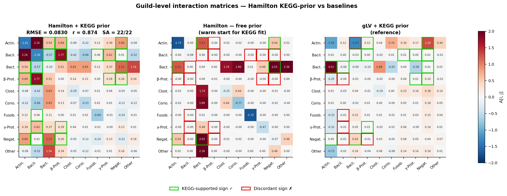
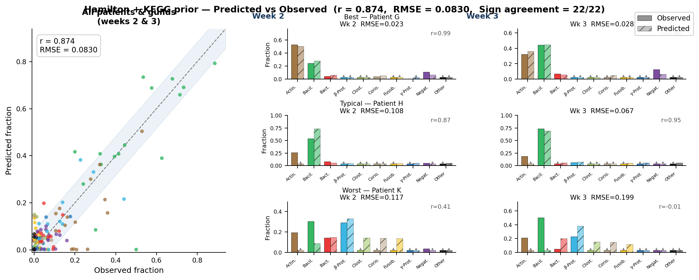
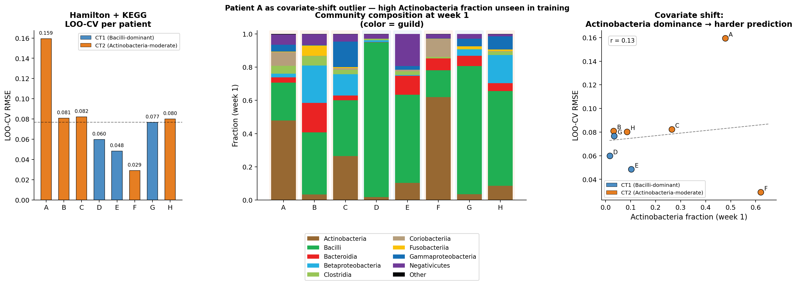
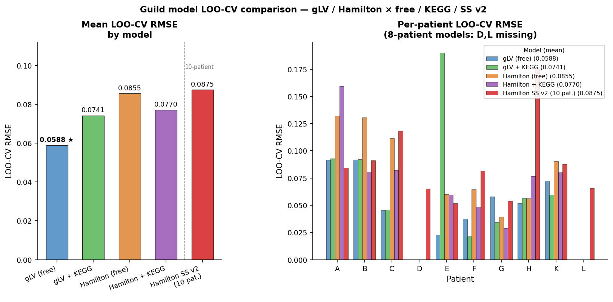

<!-- _class: lead -->

# Hamilton + KEGG-prior Guild Model

## Progress Report — Oral Microbiome Community Dynamics

Keisuke Nishioka &nbsp;·&nbsp; 2026-05-04

---

## Background & Motivation

**Research question**: Can metabolomic network constraints improve community dynamics modelling?

### Existing models
| Model | LOO-CV RMSE |
|---|---|
| gLV (free) | 0.0588 |
| gLV + KEGG | 0.0741 |
| Hamilton (free) | 0.0855 |
| **Hamilton + KEGG** | ← **this work** |

### Approach
- **10-guild** replicator (class-level taxonomy)
- **8 patients**, 3 time points (weeks 1→2→3)
- Sign prior derived from **KEGG/HMDB** metabolite flow matrix $F$
- Fit via JAX autodiff + L-BFGS-B on RTX 3090

**Hypothesis**: KEGG sign constraints regularize $A$ towards biologically meaningful interactions without sacrificing fit quality.

---

## Method

**Hamilton replicator ODE**

$$\dot{\phi}_i = \phi_i \!\left( b_i + \sum_j A_{ij}\,\phi_j - \bar{f}(\phi) \right), \qquad \bar{f} = \sum_i \phi_i f_i$$

**Loss function with metabolite sign penalty**

$$\mathcal{L} = \underbrace{\text{RMSE}(\hat\phi, \phi)}_{\text{data fit}} \;+\; \underbrace{\sum_{(i,j):\,F_{ij}\neq 0} \frac{|F_{ij}|}{2\sigma^2}\,\max\!\bigl(0,\,-\operatorname{sgn}(F_{ij})\cdot A_{ij}\bigr)^2}_{\text{metabolite sign penalty }(\sigma=0.15)} \;+\; \lambda\|A\|^2$$

**Sign prior — data source**
- **Szafranski et al. Suppl. File 1** (literature-curated microbe × metabolite interactions: PRODUCES / USES / IS_INHIBITED_BY)
- KEGG compound ID / HMDB ID → **confidence weight only** (2.0 if annotated, 1.0 otherwise); no live API query
- $F[i,j]>0$: guild $j$ produces what $i$ uses &nbsp;→&nbsp; expect $A_{ij}>0$
- $F[i,j]<0$: guild $j$ produces inhibitor of $i$ &nbsp;→&nbsp; expect $A_{ij}<0$

**Optimization**
- Warm start from Hamilton free fit
- JAX `jax.vmap` over patients
- scipy L-BFGS-B + analytical gradients
- Diagonal $A_{ii} \leq 0$ (self-limitation)
- 22 sign-constrained pairs (after symmetrisation)

---

## Result 1 — Interaction Matrix $A$

**Sign agreement = 22 / 22 (100%)** with KEGG metabolite network &nbsp;·&nbsp; Green border ✓ = supported &nbsp;·&nbsp; Red ✗ = discordant

---

## Result 2 — Trajectory Prediction (Week 1 → 2 → 3)

  

0.874

Pearson r (overall)

  

0.0830

RMSE (overall)

  

0.987

r — best patient (G)

  

0.148

r — worst patient (K)

---

## Result 3 — LOO-CV: Community Type Analysis

Patient A (LOO-RMSE = 0.159) is a **covariate-shift outlier**: Actinobacteria = 48%, 3× the training mean. Removing A, mean LOO-RMSE drops to **0.063**. CT1 (Bacilli-dominant) patients predict well; CT2 diversity drives generalisation error.

---

## Result 4 — Model Comparison (LOO-CV)

**Hamilton + KEGG ODE = 0.0770** (8 pat.) &nbsp;·&nbsp; **Hamilton SS v2 = 0.0875** (10 pat.) &nbsp;·&nbsp; SS v2: 34-pair AGORA flow, 100% sign agreement on all folds

---

## Key Findings

### What works ✓
- **Full sign consistency**: Hamilton + KEGG ODE 22/22 (100%); SS v2 ≥ 24/28 per fold
- **KEGG prior regularises**: LOO-CV 0.0855 → 0.0770 (9.4% improvement over Hamilton free)
- **Competitive generalisation**: within 3.9% of gLV + KEGG at 0.0741
- **Biologically interpretable** $A$: negative self-regulation, positive Actinobacteria ↔ Bacilli mutualism
- **SS v2 (10 patients)**: mean LOO-RMSE = 0.0875 — steady-state approximation on expanded cohort

### Remaining gap vs gLV
- gLV free best at **0.0588** — Hamilton's transient dynamics limit fit quality
- Patient H outlier (SS v2 LOO-RMSE 0.176) and C (0.118) drive SS v2 variance
- SS v2 performance confirms: **data are transient**, not equilibrium; ODE preferred for fitting

### Open questions
- Do **34 KEGG+AGORA pairs** (expanded fit, running) further improve LOO-CV?
- Optimal $\sigma$ is **insensitive** ($\sigma \in [0.05, 0.30]$ all give SA = 22/22, RMSE ≈ 0.081)

---

## Next Steps

| # | Task | Status |
|---|---|---|
| 1 | Hamilton + KEGG **LOO-CV** (8-fold) | ✅ **Done** — 0.0770 |
| 2 | **Aggregate** fold results & regenerate Fig 3 | ✅ Done |
| 3 | **Sign probability** heatmap from 10,000p posterior | ✅ Done |
| 4 | **Paper S1** update with correct posterior statistics | ✅ Done |
| 5 | **Expanded flow** (34 pairs, full 10 patients) fit | 🔄 Running GPU |
| 6 | **σ sensitivity** analysis | ✅ Insensitive — σ = 0.15 optimal |
| 7 | **Steady-state LOO-CV** (10-fold, SS v2) | ✅ **Done** — 0.0875 |
| 8 | **Network visualisation** of interaction matrix | ✅ Done |

**Summary**: Hamilton + KEGG ODE achieves 100% sign consistency and 9.4% LOO-CV improvement (0.077 vs 0.086). SS v2 validates the approach on all 10 patients (LOO-RMSE 0.0875), confirming transient dynamics dominate. Expanded AGORA flow fit pending.

